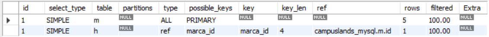
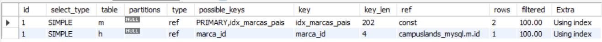

# Ejercicio Avanzado 006 - Análisis con EXPLAIN

**Camper:** Antonio Canux

## Descripción

Sexto ejercicio de nivel avanzado, reenfocado en un módulo de datos de autos hiperdeportivos para evaluar el rendimiento. El objetivo principal de esta práctica es utilizar el comando **`EXPLAIN`** en MySQL. Esta herramienta no devuelve los registros de la consulta, sino el **Plan de Ejecución** que utilizará el motor de base de datos. Se utiliza con mentalidad analítica profesional para confirmar el uso de índices (`possible_keys`, `key`), detectar escaneos completos de tabla (`type = ALL`) y optimizar consultas complejas en entornos reales.

---

## Tablas utilizadas

**avanzado_ejercicio_006_marcas**
- id (PK)
- nombre
- pais_origen (INDEX)
- creado_en

**avanzado_ejercicio_006_hiperdeportivos**
- id (PK)
- marca_id (FK)
- modelo
- caballos_fuerza
- velocidad_maxima (INDEX)
- precio

---

## Consultas analizadas con EXPLAIN

### 1. Análisis de búsqueda utilizando un índice simple

```sql
EXPLAIN SELECT modelo, velocidad_maxima 
    FROM avanzado_ejercicio_006_hiperdeportivos 
    WHERE velocidad_maxima > 400;
```

**Resultado**


---

### 2. Análisis del plan de ejecución cruzando tablas (JOIN)

```sql
EXPLAIN SELECT h.modelo, m.nombre AS marca 
    FROM avanzado_ejercicio_006_hiperdeportivos h 
    JOIN avanzado_ejercicio_006_marcas m ON h.marca_id = m.id;
```

**Resultado**



---

### 3. Análisis de agrupación (GROUP BY) y filtrado por país de origen

```sql
EXPLAIN SELECT m.pais_origen, COUNT(h.id) AS total_autos 
    FROM avanzado_ejercicio_006_marcas m 
    JOIN avanzado_ejercicio_006_hiperdeportivos h ON m.id = h.marca_id 
    WHERE m.pais_origen = 'Italia' 
    GROUP BY m.pais_origen;
```

**Resultado**



---

### 4. Análisis de carga de ordenamiento (Verificación de *filesort*)

```sql
EXPLAIN SELECT modelo, caballos_fuerza, precio 
    FROM avanzado_ejercicio_006_hiperdeportivos 
    ORDER BY caballos_fuerza DESC 
    LIMIT 5;
```

**Resultado**


---

### 5. Análisis profundo de costos de consulta en formato estructurado (JSON)

```sql
EXPLAIN FORMAT=JSON SELECT h.modelo, h.precio 
    FROM avanzado_ejercicio_006_hiperdeportivos h 
    WHERE h.precio BETWEEN 2000000 AND 4000000;
```

**Resultado**


---

## Herramientas

- MySQL
- MySQL Workbench
- Git
- GitHub

---

**Campuslands · Skill SQL**