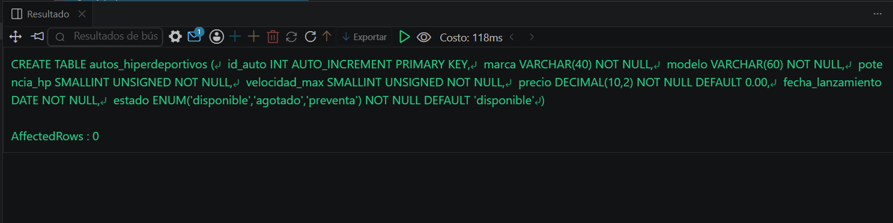
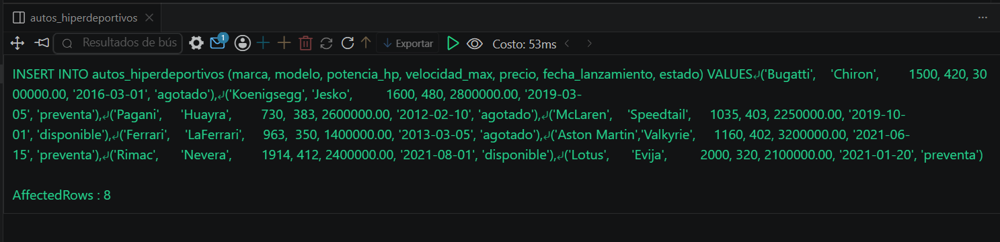
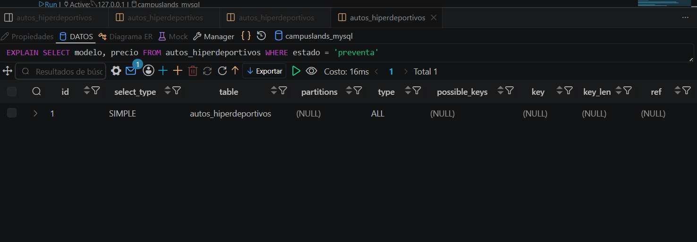

# Resolucion - Ejercicio 006 (Avanzado) - Selvin Lem

## Tematica
Autos hiperdeportivos

## Como ejecutar
1. Ejecutar `ddl/schema.sql`: crea la tabla, sin indices adicionales.
2. Ejecutar `dml/inserts.sql` para insertar 8 registros de prueba.
3. Ejecutar `dql/consultas.sql`: compara EXPLAIN antes y despues de
   crear un indice sobre marca, y revisa Extra en consultas con
   ORDER BY y filtros sin indice.

## Entidad principal
- Tabla: autos_hiperdeportivos
- Atributos clave: marca, potencia_hp, velocidad_max, precio

## Restriccion aplicada
Indice idx_marca_auto creado a mitad del script, para comparar el
plan de ejecucion antes y despues de su existencia.

## Caso limite incluido
Filtro por estado (sin indice) sigue mostrando type=ALL en EXPLAIN
aunque la tabla ya tenga un indice sobre otra columna (marca).

## Evidencia ejecucion - schema.sql

 

## Evidencia ejecucion - inserts.sql
 

## Evidencia ejecucion - consultas.sql
 