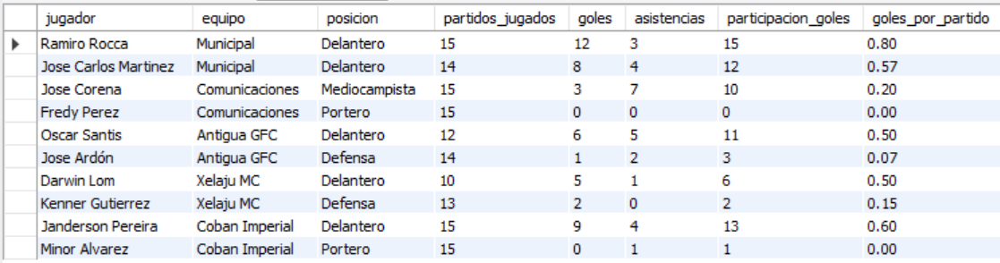
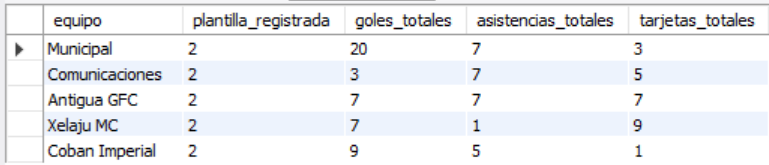
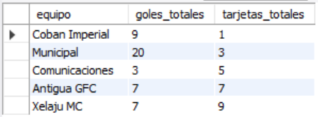
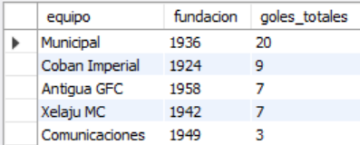

# Ejercicio Avanzado 007 - Vistas Avanzadas (CREATE VIEW)

**Camper:** Antonio Canux

## Descripción

Séptimo ejercicio de nivel avanzado, centrado en un módulo de datos estadísticos para una liga de fútbol. El objetivo de esta práctica es implementar **Vistas Avanzadas (`CREATE VIEW`)**. Una vista funciona como una "tabla virtual" que encapsula consultas complejas. En este escenario, encapsulamos un cruce de 3 tablas (`JOIN`) con campos calculados matemáticamente, y otra vista que realiza agrupaciones (`GROUP BY`) y sumatorias (`SUM`). Esto permite a otros desarrolladores consultar métricas complejas con un simple `SELECT * FROM vista`.

---

## Tablas utilizadas

**avanzado_ejercicio_007_equipos**
- id (PK)
- nombre
- ciudad
- fundacion

**avanzado_ejercicio_007_jugadores**
- id (PK)
- equipo_id (FK)
- nombre
- posicion

**avanzado_ejercicio_007_estadisticas**
- id (PK)
- jugador_id (FK)
- partidos_jugados
- goles
- asistencias
- tarjetas_amarillas

---

## Consultas y Vistas realizadas

### 1. Creación de la vista `vw_metricas_jugadores` (Campos calculados y múltiples JOINs)

```sql
CREATE VIEW vw_metricas_jugadores AS
SELECT j.nombre AS jugador, e.nombre AS equipo, j.posicion, est.partidos_jugados, est.goles, est.asistencias, (est.goles + est.asistencias) AS participacion_goles, ROUND(est.goles / NULLIF(est.partidos_jugados, 0), 2) AS goles_por_partido 
    FROM avanzado_ejercicio_007_jugadores j 
    JOIN avanzado_ejercicio_007_equipos e ON j.equipo_id = e.id 
    JOIN avanzado_ejercicio_007_estadisticas est ON j.id = est.jugador_id;
```

**Resultado**



---

### 2. Creación de la vista `vw_resumen_equipos` (Agregaciones complejas encapusladas)

```sql
CREATE VIEW vw_resumen_equipos AS
SELECT e.nombre AS equipo, COUNT(j.id) AS plantilla_registrada, SUM(est.goles) AS goles_totales, SUM(est.asistencias) AS asistencias_totales, SUM(est.tarjetas_amarillas) AS tarjetas_totales 
    FROM avanzado_ejercicio_007_equipos e 
    LEFT JOIN avanzado_ejercicio_007_jugadores j ON e.id = j.equipo_id 
    LEFT JOIN avanzado_ejercicio_007_estadisticas est ON j.id = est.jugador_id 
    GROUP BY e.id, e.nombre;
```

**Resultado**



---

### 3. Explotación de la vista: ¿Cuáles son los atacantes más efectivos (más de 0.5 goles por partido)?

```sql
SELECT jugador, equipo, participacion_goles, goles_por_partido 
    FROM vw_metricas_jugadores 
    WHERE goles_por_partido > 0.50 
    ORDER BY goles_por_partido DESC;
```

**Resultado**


---

### 4. Explotación de la vista: ¿Cuál es el equipo con mayor disciplina defensiva (menos tarjetas)?

```sql
SELECT equipo, goles_totales, tarjetas_totales 
    FROM vw_resumen_equipos 
    ORDER BY tarjetas_totales ASC;
```

**Resultado**



---

### 5. ¿Cómo cruzar la información de una vista virtual con una tabla física para reportería híbrida?

```sql
SELECT v.equipo, e.fundacion, v.goles_totales 
    FROM vw_resumen_equipos v 
    JOIN avanzado_ejercicio_007_equipos e ON v.equipo = e.nombre 
    ORDER BY v.goles_totales DESC;
```

**Resultado**



---

## Herramientas

- MySQL
- MySQL Workbench
- Git
- GitHub

---

**Campuslands · Skill SQL**