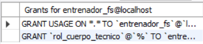
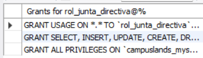

# Ejercicio Avanzado 008 - Roles y Permisos (GRANT/REVOKE)

**Camper:** Antonio Canux

## Descripción

Octavo ejercicio de nivel avanzado, estructurado sobre un módulo de datos de fútbol sala. Este ejercicio se aleja de las consultas tradicionales para enfocarse en la **Administración y Seguridad de la Base de Datos (DCL)**. El objetivo es crear Roles, definir Usuarios, y gestionar los privilegios a través de las instrucciones `GRANT` y `REVOKE`. En este escenario, separamos la información pública (jugadores) de la información sensible (salarios de los contratos), otorgando accesos limitados al cuerpo técnico y accesos administrativos a la junta directiva.

---

## Tablas utilizadas

**avanzado_ejercicio_008_jugadores**
- id (PK)
- nombre
- posicion
- dorsal

**avanzado_ejercicio_008_contratos** (Información Sensible)
- id (PK)
- jugador_id (FK)
- salario_mensual
- fecha_vencimiento

---

## Operaciones DCL realizadas

### 1. Creación de Roles de Seguridad

```sql
CREATE ROLE 'rol_cuerpo_tecnico', 'rol_junta_directiva';
```

---

### 2. Asignación de Permisos (`GRANT`) a cada Rol

```sql
GRANT SELECT ON campuslands_mysql.avanzado_ejercicio_008_jugadores TO 'rol_cuerpo_tecnico';
GRANT ALL PRIVILEGES ON campuslands_mysql.avanzado_ejercicio_008_jugadores TO 'rol_junta_directiva';
GRANT ALL PRIVILEGES ON campuslands_mysql.avanzado_ejercicio_008_contratos TO 'rol_junta_directiva';
```

---

### 3. Creación de Usuarios y Asignación de Roles por Defecto

```sql
CREATE USER 'entrenador_fs'@'localhost' IDENTIFIED BY 'pass_tecnico_123';
CREATE USER 'gerente_fs'@'localhost' IDENTIFIED BY 'pass_gerente_123';
GRANT 'rol_cuerpo_tecnico' TO 'entrenador_fs'@'localhost';
GRANT 'rol_junta_directiva' TO 'gerente_fs'@'localhost';
SET DEFAULT ROLE ALL TO 'entrenador_fs'@'localhost', 'gerente_fs'@'localhost';
```

---

### 4. ¿Cómo verificar los permisos efectivos de un usuario en el sistema?

```sql
SHOW GRANTS FOR 'entrenador_fs'@'localhost';
```

**Resultado**



---

### 5. Revocación de Privilegios (`REVOKE`): Quitar el permiso `DELETE` de la tabla de contratos a la directiva

```sql
REVOKE DELETE ON campuslands_mysql.avanzado_ejercicio_008_contratos FROM 'rol_junta_directiva';
SHOW GRANTS FOR 'rol_junta_directiva';
```

**Resultado**



---

## Herramientas

- MySQL
- MySQL Workbench
- Git
- GitHub

---

**Campuslands · Skill SQL**