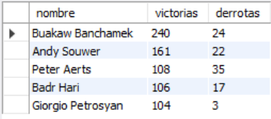
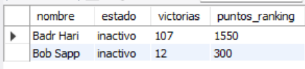

# Ejercicio Avanzado 009 - Bloqueos (LOCKS)

**Camper:** Antonio Canux

## Descripción

Noveno ejercicio de nivel avanzado, aplicado a un módulo de datos de kickboxing. El objetivo central de esta práctica es demostrar el manejo de la concurrencia a través de **Bloqueos (`LOCKS`)** en MySQL. En entornos profesionales con múltiples usuarios, evitar condiciones de carrera es crítico. Se implementan tanto bloqueos a nivel de tabla (`LOCK TABLES READ/WRITE`) para operaciones masivas, como bloqueos a nivel de fila (`FOR UPDATE`, `FOR SHARE`) dentro de transacciones de InnoDB para operaciones precisas, como la actualización del récord de un peleador tras un combate.

---

## Tabla utilizada

**avanzado_ejercicio_009_peleadores**
- id (PK)
- nombre
- categoria
- victorias
- derrotas
- puntos_ranking
- estado

---

## Consultas y Bloqueos realizados

### 1. Bloqueo de lectura a nivel de tabla (`READ LOCK`)

Impide que otras sesiones modifiquen la tabla mientras leemos un reporte de peleadores veteranos.

```sql
LOCK TABLES avanzado_ejercicio_009_peleadores READ;
SELECT nombre, victorias, derrotas 
    FROM avanzado_ejercicio_009_peleadores 
    WHERE victorias > 100 
    ORDER BY victorias DESC;
UNLOCK TABLES;
```

**Resultado**



---

### 2. Bloqueo de escritura a nivel de tabla (`WRITE LOCK`)

Otorga acceso exclusivo a esta sesión para actualizar masivamente a inactivos a aquellos con un récord negativo alto.

```sql
LOCK TABLES avanzado_ejercicio_009_peleadores WRITE;
UPDATE avanzado_ejercicio_009_peleadores 
    SET estado = 'inactivo' 
    WHERE derrotas > 15 AND estado = 'activo';
UNLOCK TABLES;
```

---

### 3. Bloqueo de fila exclusivo dentro de una transacción (`FOR UPDATE`)

Garantiza que nadie más pueda leer ni modificar el registro de 'Badr Hari' mientras le sumamos una victoria.

```sql
START TRANSACTION;
SELECT nombre, victorias, puntos_ranking 
    FROM avanzado_ejercicio_009_peleadores 
    WHERE nombre = 'Badr Hari' FOR UPDATE;
UPDATE avanzado_ejercicio_009_peleadores 
    SET victorias = victorias + 1, puntos_ranking = puntos_ranking + 50 
    WHERE nombre = 'Badr Hari';
COMMIT;
```

**Resultado**


---

### 4. Bloqueo de fila compartido (`FOR SHARE`)

Permite a otras sesiones leer, pero no modificar, las filas de 'Peso Pesado' mientras calculamos su promedio de puntos.

```sql
START TRANSACTION;
SELECT categoria, ROUND(AVG(puntos_ranking), 2) AS promedio_puntos 
    FROM avanzado_ejercicio_009_peleadores 
    WHERE categoria = 'Peso Pesado' FOR SHARE;
COMMIT;
```

**Resultado**


---

### 5. Verificación de los resultados finales

```sql
SELECT nombre, estado, victorias, puntos_ranking 
    FROM avanzado_ejercicio_009_peleadores 
    WHERE nombre = 'Badr Hari' OR nombre = 'Bob Sapp';
```

**Resultado**



---

## Herramientas

- MySQL
- MySQL Workbench
- Git
- GitHub

---

**Campuslands · Skill SQL**