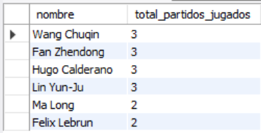
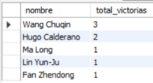
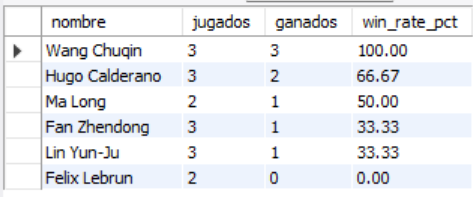
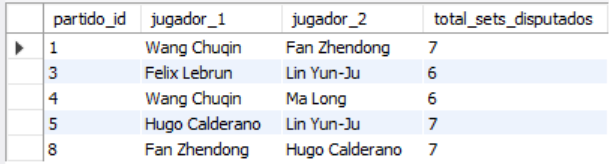
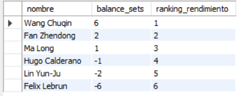

# Ejercicio Avanzado 011 - Common Table Expressions (CTE)

**Camper:** Antonio Canux

## Descripción

Undécimo ejercicio de nivel avanzado, reenfocado en un módulo de datos de pingpong para elevar la complejidad analítica. El objetivo central es implementar **Common Table Expressions (`WITH`)**. Las CTEs actúan como vistas temporales que existen únicamente durante la ejecución de una consulta. Son la herramienta profesional estándar para descomponer consultas complejas en bloques lógicos, evitar la anidación excesiva de subconsultas, y permitir el cálculo de indicadores de rendimiento (como el *Win Rate* o balances netos) de forma estructurada y legible.

---

## Tablas utilizadas

**avanzado_ejercicio_011_jugadores**
- id (PK)
- nombre
- pais
- ranking_mundial

**avanzado_ejercicio_011_partidos**
- id (PK)
- jugador1_id (FK)
- jugador2_id (FK)
- sets_jugador1
- sets_jugador2
- fecha_partido

---

## Consultas analíticas realizadas

### 1. ¿Cuántos partidos ha disputado cada jugador en total (unificando ambos lados de la mesa mediante una CTE)?

```sql
WITH Participaciones AS (
    SELECT jugador1_id AS jugador_id 
        FROM avanzado_ejercicio_011_partidos
    UNION ALL
    SELECT jugador2_id AS jugador_id 
        FROM avanzado_ejercicio_011_partidos
)
SELECT j.nombre, COUNT(p.jugador_id) AS total_partidos_jugados
FROM avanzado_ejercicio_011_jugadores j
JOIN Participaciones p ON j.id = p.jugador_id
GROUP BY j.id, j.nombre
ORDER BY total_partidos_jugados DESC;
```

**Resultado**



---

### 2. ¿Cuántas victorias acumuló cada jugador durante el torneo calculando el ganador en una tabla temporal?

```sql
WITH Ganadores AS (
    SELECT id AS partido_id, 
           CASE WHEN sets_jugador1 > sets_jugador2 THEN jugador1_id 
           ELSE jugador2_id END AS ganador_id
    FROM avanzado_ejercicio_011_partidos
)
SELECT j.nombre, COUNT(g.partido_id) AS total_victorias
    FROM avanzado_ejercicio_011_jugadores j
    JOIN Ganadores g ON j.id = g.ganador_id
    GROUP BY j.id, j.nombre
    ORDER BY total_victorias DESC;
```

**Resultado**



---

### 3. Uso de múltiples CTEs: ¿Cuál es el porcentaje de victorias (*Win Rate*) cruzando partidos jugados y ganados?

```sql
WITH TotalJugados AS (
    SELECT jugador_id, COUNT(jugador_id) AS jugados 
    FROM (
        SELECT jugador1_id AS jugador_id 
        FROM avanzado_ejercicio_011_partidos
        UNION ALL SELECT jugador2_id 
        FROM avanzado_ejercicio_011_partidos
    ) t GROUP BY jugador_id
),
TotalGanados AS (
    SELECT ganador_id, COUNT(ganador_id) AS ganados 
    FROM (
        SELECT CASE WHEN sets_jugador1 > sets_jugador2 THEN jugador1_id 
        ELSE jugador2_id END AS ganador_id
        FROM avanzado_ejercicio_011_partidos
    ) g 
    GROUP BY ganador_id
)
SELECT j.nombre, tj.jugados, IFNULL(tg.ganados, 0) AS ganados,
           ROUND((IFNULL(tg.ganados, 0) / tj.jugados) * 100, 2) AS win_rate_pct
    FROM avanzado_ejercicio_011_jugadores j
    JOIN TotalJugados tj ON j.id = tj.jugador_id
    LEFT JOIN TotalGanados tg ON j.id = tg.ganador_id
    ORDER BY win_rate_pct DESC;
```

**Resultado**



---

### 4. ¿Qué partidos fueron más largos que el promedio general del torneo (usando una CTE como referencia escalar)?

```sql
WITH PromedioSets AS (
    SELECT AVG(sets_jugador1 + sets_jugador2) AS promedio_global 
    FROM avanzado_ejercicio_011_partidos
)
SELECT p.id AS partido_id, j1.nombre AS jugador_1, j2.nombre AS jugador_2, (p.sets_jugador1 + p.sets_jugador2) AS total_sets_disputados
    FROM avanzado_ejercicio_011_partidos p
    JOIN avanzado_ejercicio_011_jugadores j1 ON p.jugador1_id = j1.id
    JOIN avanzado_ejercicio_011_jugadores j2 ON p.jugador2_id = j2.id
    CROSS JOIN PromedioSets ps
    WHERE (p.sets_jugador1 + p.sets_jugador2) > ps.promedio_global;
```

**Resultado**



---

### 5. ¿Cuál es el ranking de rendimiento basado en el balance neto de sets (Diferencia a favor vs en contra) uniendo CTEs y Window Functions?

```sql
WITH DiferenciaSets AS (
    SELECT jugador1_id AS jugador_id, (sets_jugador1 - sets_jugador2) AS dif 
    FROM avanzado_ejercicio_011_partidos
    UNION ALL
    SELECT jugador2_id, (sets_jugador2 - sets_jugador1) 
    FROM avanzado_ejercicio_011_partidos
),
Consolidado AS (
    SELECT j.nombre, SUM(d.dif) AS balance_sets
        FROM avanzado_ejercicio_011_jugadores j
        JOIN DiferenciaSets d ON j.id = d.jugador_id
        GROUP BY j.id, j.nombre
)
SELECT nombre, balance_sets, RANK() OVER(ORDER BY balance_sets DESC) AS ranking_rendimiento
    FROM Consolidado;
```

**Resultado**



---

## Herramientas

- MySQL
- MySQL Workbench
- Git
- GitHub

---

**Campuslands · Skill SQL**