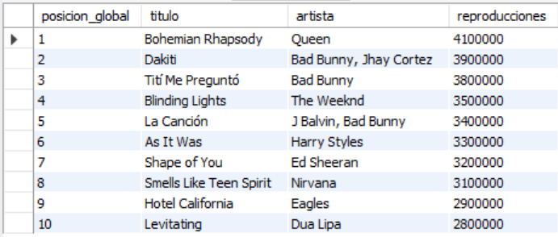
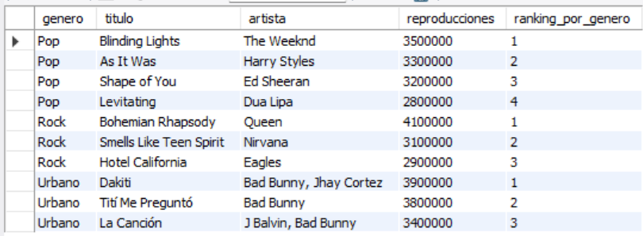
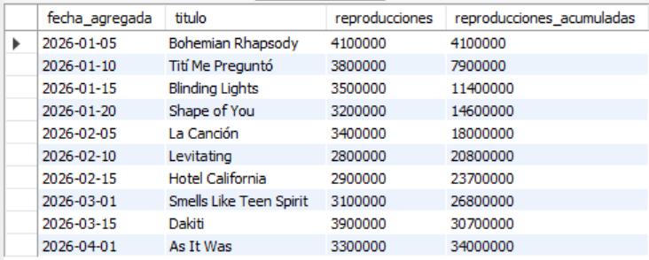
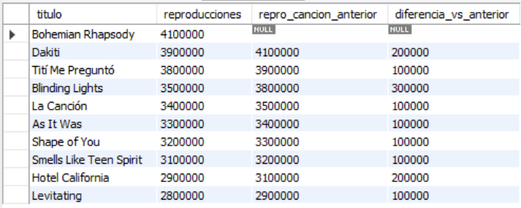
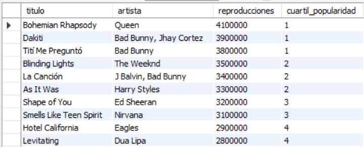

# Ejercicio Avanzado 012 - Window Functions

**Camper:** Antonio Canux

## Descripción

Duodécimo ejercicio de nivel avanzado, aplicado a un módulo de datos de una playlist musical. El objetivo central de esta práctica es implementar **Window Functions** (Funciones de Ventana). A diferencia de las funciones de agregación tradicionales (`GROUP BY`) que colapsan múltiples filas en una sola, las *Window Functions* permiten realizar cálculos a través de un conjunto de filas relacionadas con la fila actual, manteniendo el detalle de cada registro original. Son esenciales en analítica de datos para calcular rankings, totales acumulados (running totals) y comparar valores entre filas adyacentes.

---

## Tablas utilizadas

**avanzado_ejercicio_012_canciones**
- id (PK)
- titulo
- artista
- genero
- reproducciones
- fecha_agregada

---

## Consultas analíticas realizadas

### 1. ¿Cuál es el ranking global de canciones asignando un número de posición único (`ROW_NUMBER`)?

```sql
SELECT ROW_NUMBER() OVER(ORDER BY reproducciones DESC) AS posicion_global, 
           titulo, artista, reproducciones 
    FROM avanzado_ejercicio_012_canciones;
```

**Resultado**



---

### 2. ¿Cuál es el top de canciones compitiendo únicamente dentro de su propio género musical (`DENSE_RANK` + `PARTITION BY`)?

```sql
SELECT genero, titulo, artista, reproducciones,
           DENSE_RANK() OVER(PARTITION BY genero ORDER BY reproducciones DESC) AS ranking_por_genero
    FROM avanzado_ejercicio_012_canciones;
```

**Resultado**



---

### 3. ¿Cómo fue el crecimiento acumulado del volumen de reproducciones a lo largo del tiempo (`SUM OVER`)?

```sql
SELECT fecha_agregada, titulo, reproducciones,
           SUM(reproducciones) OVER(ORDER BY fecha_agregada ASC) AS reproducciones_acumuladas
    FROM avanzado_ejercicio_012_canciones;
```

**Resultado**



---

### 4. ¿Cuál es la diferencia exacta de reproducciones entre una canción y la que está justo por encima de ella en el ranking (`LAG`)?

```sql
SELECT titulo, reproducciones,
           LAG(reproducciones) OVER(ORDER BY reproducciones DESC) AS repro_cancion_anterior,
           (LAG(reproducciones) OVER(ORDER BY reproducciones DESC) - reproducciones) AS diferencia_vs_anterior
    FROM avanzado_ejercicio_012_canciones;
```

**Resultado**



---

### 5. ¿Cómo segmentar equitativamente el catálogo en 4 niveles (cuartiles) de popularidad (`NTILE`)?

```sql
SELECT titulo, artista, reproducciones,
           NTILE(4) OVER(ORDER BY reproducciones DESC) AS cuartil_popularidad
    FROM avanzado_ejercicio_012_canciones;
```

**Resultado**



---

## Herramientas

- MySQL
- MySQL Workbench
- Git
- GitHub

---

**Campuslands · Skill SQL**