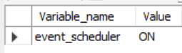
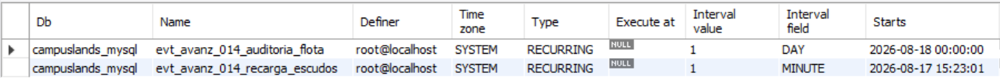
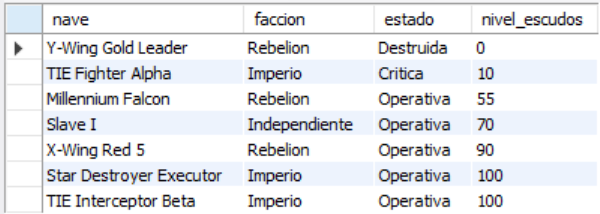
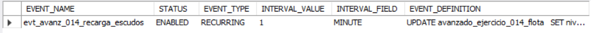
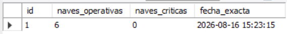

# Ejercicio Avanzado 014 - Event Scheduler

**Camper:** Antonio Canux

## Descripción

Decimocuarto ejercicio de nivel avanzado, aplicado a un módulo de datos de una flota estelar (Ciencia Ficción). El objetivo central de esta práctica es dominar el **`EVENT SCHEDULER`** nativo de MySQL. Los eventos son tareas programadas (similares a los *Cron Jobs* en Linux) que se ejecutan automáticamente en segundo plano según una calendarización definida (ej. cada minuto, cada semana, o en una fecha exacta). Son indispensables para el mantenimiento autónomo de la base de datos: limpieza de registros antiguos, cálculos de auditoría diarios, o como en este caso, la regeneración progresiva de estadísticas (escudos) sin intervención de un servidor backend externo.

---

## Tablas y Eventos utilizados

**avanzado_ejercicio_014_flota**
- id (PK)
- nave
- faccion
- estado (ENUM)
- nivel_escudos

**avanzado_ejercicio_014_auditoria**
- id (PK)
- naves_operativas
- naves_criticas
- fecha_registro

**Eventos Programados:**
1. `evt_avanz_014_recarga_escudos`: Se ejecuta **cada 1 minuto** haciendo un `UPDATE` automático para subir +10 a los escudos de naves operativas.
2. `evt_avanz_014_auditoria_flota`: Se ejecuta **diariamente** haciendo un `INSERT` con el conteo general de la flota.

---

## Consultas realizadas

### 1. ¿Cómo verificar a nivel de servidor que el motor de eventos automáticos está encendido?

```sql
SHOW VARIABLES LIKE 'event_scheduler';
```

**Resultado**



---

### 2. ¿Cómo listar los eventos programados que están corriendo actualmente en la base de datos?

```sql
SHOW EVENTS FROM campuslands_mysql;
```

**Resultado**



---

### 3. ¿Cuál es el estado actual de los escudos de la flota? *(Nota: Estos valores subirán automáticamente con el paso de los minutos debido al evento 1)*

```sql
SELECT nave, faccion, estado, nivel_escudos 
    FROM avanzado_ejercicio_014_flota 
    ORDER BY nivel_escudos ASC;
```

**Resultado**



---

### 4. ¿Cómo inspeccionar el código interno (`EVENT_DEFINITION`) y la frecuencia de un evento ya creado usando `INFORMATION_SCHEMA`?

```sql
SELECT EVENT_NAME, STATUS, EVENT_TYPE, INTERVAL_VALUE, INTERVAL_FIELD, EVENT_DEFINITION 
    FROM INFORMATION_SCHEMA.EVENTS 
    WHERE EVENT_SCHEMA = 'campuslands_mysql' AND EVENT_NAME = 'evt_avanz_014_recarga_escudos';
```

**Resultado**



---

### 5. ¿Cuál es el registro de auditoría actual que se alimentará automáticamente cada día gracias al evento 2?

```sql
SELECT id, naves_operativas, naves_criticas, DATE_FORMAT(fecha_registro, '%Y-%m-%d %H:%i:%s') AS fecha_exacta 
    FROM avanzado_ejercicio_014_auditoria 
    ORDER BY fecha_registro DESC;
```

**Resultado**



---

## Herramientas

- MySQL (Requiere privilegios de SUPER o EVENT)
- MySQL Workbench
- Git
- GitHub

---

**Campuslands · Skill SQL**