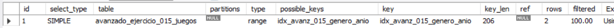
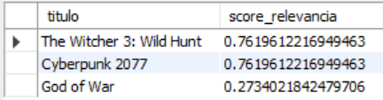
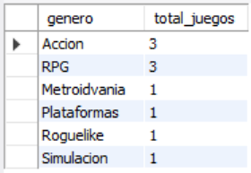
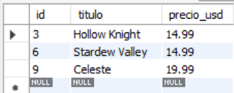

# Ejercicio Avanzado 015 - Optimización

**Camper:** Antonio Canux

## Descripción

Decimoquinto y último ejercicio general de tu repositorio, enfocado en un módulo de datos de una biblioteca gamer. El objetivo técnico que corona el nivel avanzado es la **Optimización en MySQL**. A nivel profesional, no basta con que una consulta "devuelva el resultado correcto"; debe hacerlo consumiendo la menor cantidad de recursos posibles. Para ello implementamos la creación estratégica de Índices `B-Tree` y `FULLTEXT`, auditamos nuestras sentencias con el comando `EXPLAIN`, reemplazamos el ineficiente `LIKE '%...%'` por la función `MATCH() AGAINST()`, y aplicamos las mejores prácticas de proyección evitando el uso de `SELECT *`.

---

## Tablas e Índices utilizados

**avanzado_ejercicio_015_juegos**
- id (PK)
- titulo
- genero
- desarrollador
- descripcion
- precio_usd
- anio_lanzamiento

**Índices (Optimización Estructural):**
1. `INDEX idx_avanz_015_genero_anio (genero, anio_lanzamiento)`: Acelera filtrados y agrupaciones en búsquedas exactas combinadas.
2. `FULLTEXT INDEX ft_avanz_015_titulo_desc (titulo, descripcion)`: Permite algoritmos de búsqueda difusa ultra rápidos en textos largos, generando un "score" de relevancia.

---

## Consultas realizadas

### 1. ¿Cómo auditar el plan de ejecución de MySQL para confirmar el uso de nuestros índices (`EXPLAIN`)?

```sql
EXPLAIN SELECT titulo, desarrollador 
    FROM avanzado_ejercicio_015_juegos 
    WHERE genero = 'RPG' AND anio_lanzamiento >= 2020;
```

**Resultado**



---

### 2. ¿Cómo realizar una búsqueda de texto eficiente (sin usar `LIKE`) evaluando la relevancia del resultado?

```sql
SELECT titulo, MATCH(titulo, descripcion) AGAINST('mundo abierto' IN NATURAL LANGUAGE MODE) AS score_relevancia
    FROM avanzado_ejercicio_015_juegos 
    WHERE MATCH(titulo, descripcion) AGAINST('mundo abierto' IN NATURAL LANGUAGE MODE)
    ORDER BY score_relevancia DESC;
```

**Resultado**



---

### 3. ¿Cómo utilizar la búsqueda booleana Full-Text para exigir o excluir palabras clave específicas?

```sql
SELECT titulo, descripcion 
    FROM avanzado_ejercicio_015_juegos
    WHERE MATCH(titulo, descripcion) AGAINST('+dioses -Inframundo' IN BOOLEAN MODE);
```

**Resultado**


---

### 4. ¿Cuál es el conteo de juegos por género aprovechando la optimización de un índice existente (Covering Index)?

```sql
SELECT genero, COUNT(id) AS total_juegos 
    FROM avanzado_ejercicio_015_juegos 
    GROUP BY genero 
    ORDER BY total_juegos DESC;
```

**Resultado**



---

### 5. Regla de oro de la optimización (Evitar `SELECT *`): ¿Cuáles son los juegos más baratos consultando estrictamente lo necesario?

```sql
SELECT id, titulo, precio_usd 
    FROM avanzado_ejercicio_015_juegos 
    WHERE precio_usd < 20.00 
    ORDER BY precio_usd ASC;
```

**Resultado**



---

## Herramientas

- MySQL
- MySQL Workbench
- Git
- GitHub

---

**Campuslands · Skill SQL**