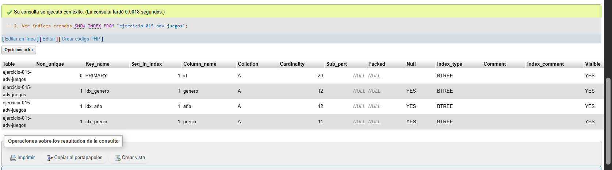
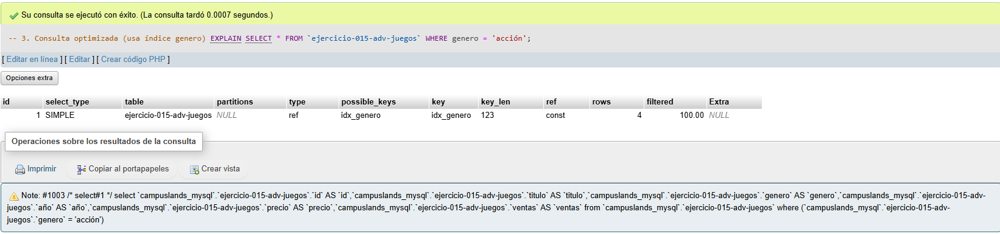
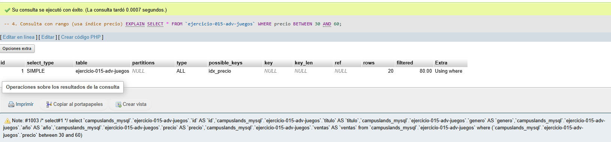
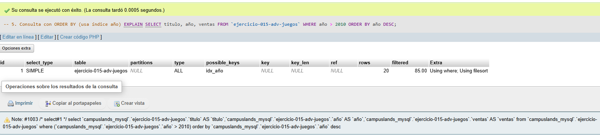

# Ejercicio 015 - Nivel Avanzado - Optimización Biblioteca Gamer

## 1. Temática

Biblioteca gamer con optimización usando índices y análisis de rendimiento.

## 2. Decisiones Técnicas

- **Diseño de Tablas (DDL):**
  - Una tabla: `ejercicio-015-adv-juegos`.
  - Columnas: `id`, `titulo`, `genero`, `año`, `precio`, `ventas`.
  - PRIMARY KEY en `id` (índice automático).
  - Uso de comillas invertidas para nombres con guiones.

- **Índices creados:**
  - `idx_genero`: Para filtrar por género.
  - `idx_año`: Para ordenar y filtrar por año.
  - `idx_precio`: Para búsquedas por rango de precios.

- **Ventajas de índices:**
  - Aceleran consultas SELECT.
  - Mejoran rendimiento en WHERE, ORDER BY, JOIN.
  - Reducen tiempo de respuesta.

- **Análisis con EXPLAIN:**
  - `type`: Tipo de acceso (ALL, ref, range, etc.).
  - `possible_keys`: Índices disponibles.
  - `key`: Índice usado.
  - `rows`: Filas estimadas a escanear.
  - `Extra`: Información adicional.

- **Inserción de Datos (DML):**
  - 20 juegos con datos variados.

- **Consultas (DQL):**
  - `SHOW INDEX`: Ver índices.
  - `EXPLAIN`: Analizar consultas.
  - Comparar consultas con y sin índices.

## 3. Evidencias

<!-- Capturas aquí -->

*A continuación, se adjuntan capturas de pantalla que demuestran la ejecución y los resultados de los scripts SQL en phpMyAdmin.*

Definición de tablas

Insertar datos

Consulta 1.1

Consulta 1.2

Consulta 1.3

Consulta 2

Consulta 3

Consulta 4

Consulta 5
