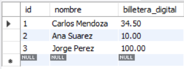
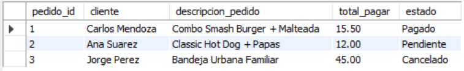

# Ejercicio Avanzado 016 - Transacciones (TCL)

**Camper:** Antonio Canux

## Descripción

Decimosexto ejercicio de nivel avanzado, aplicado a un módulo de datos de un restaurante de comida urbana. El objetivo técnico central es dominar el **Control de Transacciones (TCL)**. A nivel profesional, las transacciones garantizan el principio **ACID** (Atomicidad, Consistencia, Aislamiento, Durabilidad). Cuando una operación de negocio requiere múltiples sentencias SQL (como descontar dinero de una billetera digital y actualizar el estado de un pedido), usamos `START TRANSACTION`. Si todas las consultas tienen éxito, consolidamos los cambios con **`COMMIT`**. Si una falla, deshacemos todo el bloque con **`ROLLBACK`**, previniendo que los datos queden inconsistentes (ej. que se pague el pedido pero no se descuente el dinero).

---

## Tablas utilizadas

**avanzado_ejercicio_016_clientes**
- id (PK)
- nombre
- billetera_digital (CHECK >= 0)

**avanzado_ejercicio_016_pedidos**
- id (PK)
- cliente_id (FK)
- descripcion_pedido
- total_pagar
- estado (ENUM)

---

## Consultas de Control de Transacciones

### 1. Transacción Exitosa (`COMMIT`)
Ejecutamos el pago del cliente 1. Se reduce su saldo y se actualiza el pedido. Al usar `COMMIT`, los cambios se vuelven permanentes.

```sql
START TRANSACTION;
    UPDATE avanzado_ejercicio_016_clientes 
        SET billetera_digital = billetera_digital - 15.50 
        WHERE id = 1;
    UPDATE avanzado_ejercicio_016_pedidos 
        SET estado = 'Pagado' 
        WHERE id = 1;
COMMIT;
```

### 2. Transacción Fallida (`ROLLBACK`)
El cliente 2 intenta pagar un pedido de $12.00 pero solo tiene $10.00. La transacción se cancela con `ROLLBACK`, devolviendo los datos a su estado original.

```sql
START TRANSACTION;
    UPDATE avanzado_ejercicio_016_pedidos 
        SET estado = 'Pagado' 
        WHERE id = 2;
-- Falla logica detectada (Saldo insuficiente)
ROLLBACK;
```

### 3. Transacción Parcial (`SAVEPOINT`)
Cancelamos un pedido, creamos un "punto de guardado", ejecutamos una consulta errónea y luego revertimos la ejecución *únicamente* hasta el punto de guardado, salvando la primera operación.

```sql
START TRANSACTION;
    UPDATE avanzado_ejercicio_016_pedidos 
        SET estado = 'Cancelado' 
        WHERE id = 3;
SAVEPOINT punto_seguro;
-- Error logico simulado: Se agregan 1000 dolares por accidente
    UPDATE avanzado_ejercicio_016_clientes 
        SET billetera_digital = billetera_digital + 1000.00 
        WHERE id = 3;
-- Deshacemos solo el error, pero mantenemos la cancelacion del pedido
ROLLBACK TO punto_seguro;
COMMIT;
```

---

## Verificación de Resultados

### 4. ¿Cuál es el estado final de las billeteras tras las transacciones?

```sql
SELECT id, nombre, billetera_digital 
    FROM avanzado_ejercicio_016_clientes 
    ORDER BY id ASC;
```

**Resultado Esperado:** 
Carlos: 34.50 (Pago exitoso)
Ana: 10.00 (Pago revertido)
Jorge: 100.00 (Reembolso erróneo revertido)



---

### 5. ¿Cómo quedaron finalmente los pedidos en el sistema?

```sql
SELECT p.id AS pedido_id, c.nombre AS cliente, p.descripcion_pedido, p.total_pagar, p.estado 
    FROM avanzado_ejercicio_016_pedidos p
    JOIN avanzado_ejercicio_016_clientes c ON p.cliente_id = c.id
    ORDER BY p.id ASC;
```

**Resultado Esperado:** 
Pedido 1: Pagado
Pedido 2: Pendiente
Pedido 3: Cancelado



---

## Herramientas

- MySQL
- MySQL Workbench
- Git
- GitHub

---

**Campuslands · Skill SQL**