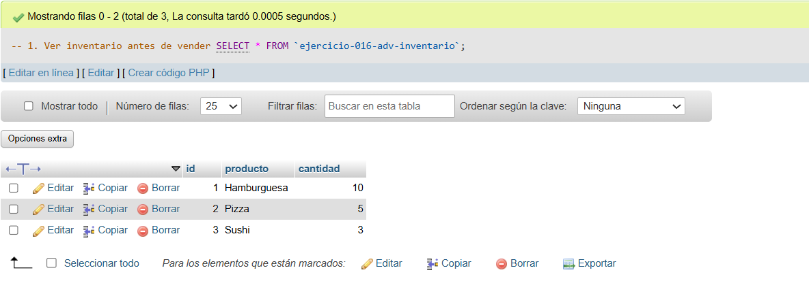
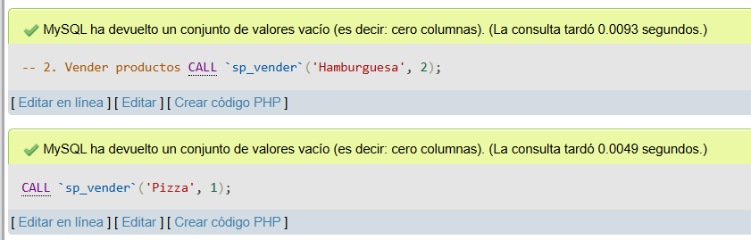
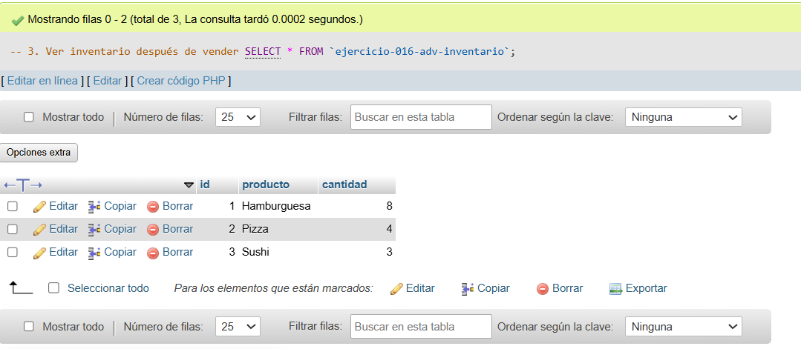

# Ejercicio 016 - Nivel Avanzado - Transacciones Restaurante Comida Urbana

## 1. Temática

Restaurante de comida urbana con transacciones para gestionar ventas e inventario.

## 2. Decisiones Técnicas

- **Diseño de Tablas (DDL):**
  - Tabla de inventario: `ejercicio-016-adv-inventario`.
  - Tabla de ventas: `ejercicio-016-adv-ventas`.
  - Uso de comillas invertidas para nombres con guiones.

- **Inserción de Datos (DML):**
  - 3 productos con cantidades iniciales.
  - Procedimiento `sp_vender` con transacción.

- **Consultas (DQL):**
  - La consulta `1` muestra inventario antes de vender.
  - La consulta `2` ejecuta las ventas con el procedimiento.
  - La consulta `3` muestra inventario actualizado.
  - La consulta `4` muestra historial de ventas.

## 3. Evidencias

<!-- Capturas aquí -->

*A continuación, se adjuntan capturas de pantalla que demuestran la ejecución y los resultados de los scripts SQL en phpMyAdmin.*

Definición de tablas e inserción de datos

Consulta 1

Consulta 2

Consulta 3

