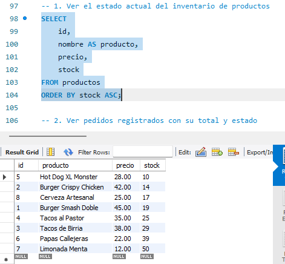
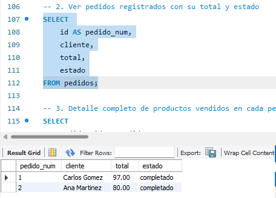
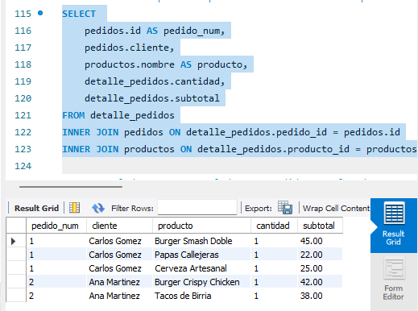
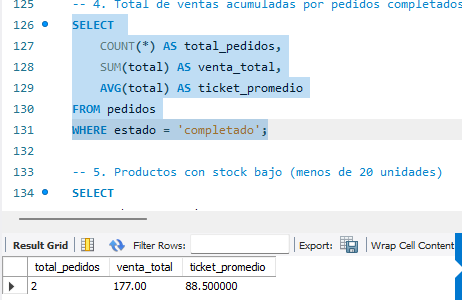
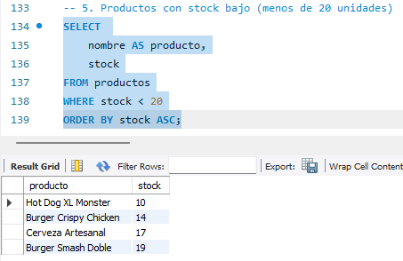

# Solución Ejercicio 016 (Avanzado) - Transacciones Restaurante Urbano

## Descripción
Solución del ejercicio avanzado para la gestión de pedidos e inventario usando transacciones (`START TRANSACTION`, `COMMIT`, `ROLLBACK`).

## Pasos para ejecutar
1. Ejecuta `ddl/schema.sql` para crear las tablas (`productos`, `pedidos`, `detalle_pedidos`).
2. Ejecuta `dml/inserts.sql` para insertar productos y simular pedidos mediante transacciones.
3. Ejecuta `dql/consultas.sql` para validar el estado final de las tablas e indicadores.

## consulta 1

## consulta 2

## consulta 3

## consulta 4

## consulta 5

