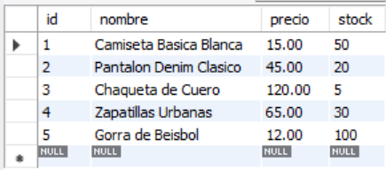
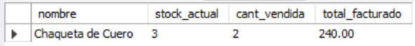
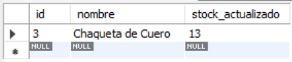

# Ejercicio Avanzado 017 - Procedimientos Almacenados (Stored Procedures)

**Camper:** Antonio Canux

## Descripción

Decimoséptimo ejercicio de nivel avanzado, enfocado en un módulo de datos de una tienda de ropa. El objetivo técnico central es dominar la creación y ejecución de **Procedimientos Almacenados (`CREATE PROCEDURE`)**. Un procedimiento almacenado es un conjunto de instrucciones SQL precompiladas que pueden aceptar parámetros de entrada (`IN`), contener lógica de programación (variables, `IF/ELSE`) y encapsular múltiples operaciones de base de datos en un solo llamado. A nivel profesional, esto encapsula la lógica de negocio en la capa de datos, reduciendo el tráfico de red y asegurando la integridad transaccional (ej. validar stock, registrar la venta y descontar el inventario de manera atómica).

---

## Tablas y Procedimientos utilizados

**avanzado_ejercicio_017_prendas**
- id (PK)
- nombre
- categoria
- precio
- stock

**avanzado_ejercicio_017_ventas**
- id (PK)
- prenda_id (FK)
- cantidad
- total
- fecha_venta

**Procedimientos Almacenados:**
1. `sp_avanz_017_registrar_venta(prenda_id, cantidad)`: Valida inventario, registra la venta y descuenta el stock.
2. `sp_avanz_017_reabastecer_stock(prenda_id, cantidad)`: Suma unidades al stock existente.

---

## Consultas de Ejecución (`CALL`)

### 1. Estado inicial del inventario antes de las operaciones

```sql
SELECT id, nombre, precio, stock 
    FROM avanzado_ejercicio_017_prendas 
    ORDER BY id ASC;
```

**Resultado**



---

### 2. ¿Cómo invocar el procedimiento para registrar una venta en la base de datos?

```sql
CALL sp_avanz_017_registrar_venta(3, 2);
```

---

### 3. ¿Cómo verificamos que el procedimiento restó el stock e insertó la venta correctamente?

```sql
SELECT p.nombre, p.stock AS stock_actual, v.cantidad AS cant_vendida, v.total AS total_facturado 
    FROM avanzado_ejercicio_017_prendas p
    JOIN avanzado_ejercicio_017_ventas v ON p.id = v.prenda_id
    WHERE p.id = 3;
```

**Resultado**



---

### 4. ¿Cómo invocar el procedimiento secundario para añadir más stock?

```sql
CALL sp_avanz_017_reabastecer_stock(3, 10);
```

---

### 5. ¿Cuál es el estado final del inventario modificado?

```sql
SELECT id, nombre, stock AS stock_actualizado 
    FROM avanzado_ejercicio_017_prendas 
    WHERE id = 3;
```

**Resultado**



---

## Herramientas

- MySQL
- MySQL Workbench
- Git
- GitHub

---

**Campuslands · Skill SQL**
