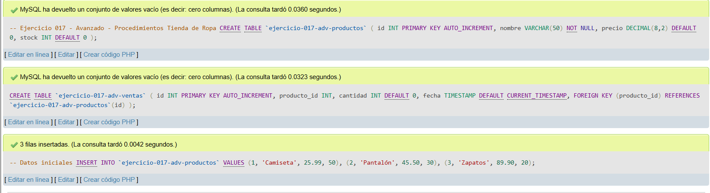
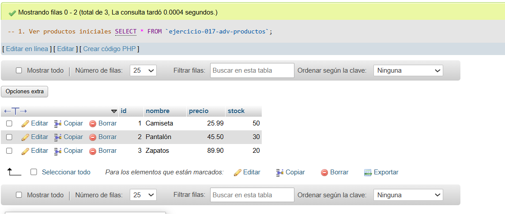
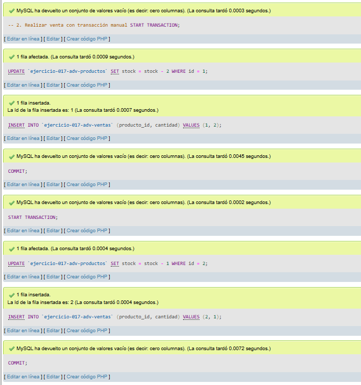
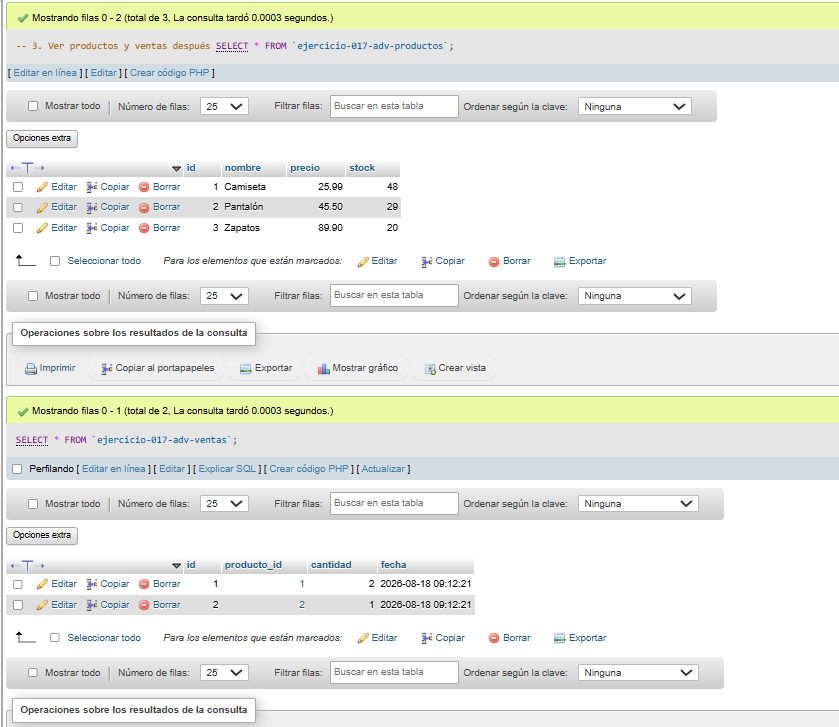

# Ejercicio 017 - Nivel Avanzado - Procedimientos Tienda de Ropa

## 1. Temática

Tienda de ropa con transacciones para gestionar ventas sin procedimientos.

## 2. Decisiones Técnicas

- **Diseño de Tablas (DDL):**
  - Tabla de productos: `ejercicio-017-adv-productos`.
  - Tabla de ventas: `ejercicio-017-adv-ventas`.
  - FOREIGN KEY en `producto_id` → `productos(id)`.
  - Uso de comillas invertidas para nombres con guiones.

- **Inserción de Datos (DML):**
  - 3 productos con stock inicial.

- **Consultas (DQL):**
  - La consulta `1` muestra productos iniciales.
  - La consulta `2` realiza ventas con transacciones START TRANSACTION/COMMIT.
  - La consulta `3` muestra productos y ventas actualizados.

## 3. Evidencias

<!-- Capturas aquí -->

*A continuación, se adjuntan capturas de pantalla que demuestran la ejecución y los resultados de los scripts SQL en phpMyAdmin.*

Definición de tablas e inserción de datos

Consulta 1

Consulta 2

Consulta 3

