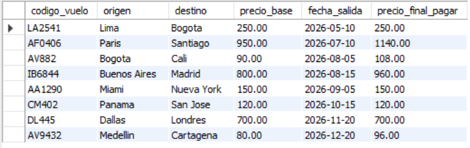
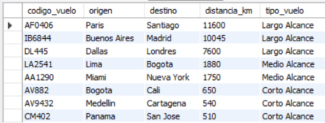
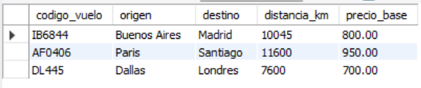
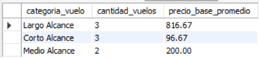

# Ejercicio Avanzado 018 - Funciones SQL (User-Defined Functions)

**Camper:** Antonio Canux

## Descripción

Decimoctavo ejercicio de nivel avanzado, aplicado a un módulo de datos de una agencia de viajes y turismo. El objetivo técnico central es dominar la creación de **Funciones Definidas por el Usuario (`CREATE FUNCTION`)**. A diferencia de los Procedimientos Almacenados (que ejecutan acciones y se llaman con `CALL`), las funciones *siempre* devuelven un único valor escalar mediante la cláusula `RETURNS` y están diseñadas para ser incrustadas directamente dentro de sentencias `SELECT`, `WHERE` o `GROUP BY`. Esto permite estandarizar cálculos lógicos complejos (como reglas de negocio para precios de temporada o clasificación de distancias) y reutilizarlos limpiamente a lo largo de toda la base de datos.

---

## Tablas y Funciones utilizadas

**avanzado_ejercicio_018_vuelos**
- id (PK)
- codigo_vuelo (UNIQUE)
- origen
- destino
- distancia_km
- precio_base
- fecha_salida

**Funciones Definidas por el Usuario (UDF):**
1. `fn_avanz_018_calcular_precio_temporada(precio_base, fecha_vuelo)`: Devuelve el precio con un recargo del 20% si el vuelo ocurre en meses de temporada alta (julio, agosto, diciembre).
2. `fn_avanz_018_categorizar_vuelo(distancia_km)`: Evalúa la distancia y devuelve 'Corto Alcance', 'Medio Alcance' o 'Largo Alcance'.

---

## Consultas de Ejecución

### 1. ¿Cómo calcular el precio a cobrar a los pasajeros evaluando la temporada de forma dinámica?

```sql
SELECT codigo_vuelo, origen, destino, precio_base, fecha_salida,
           fn_avanz_018_calcular_precio_temporada(precio_base, fecha_salida) AS precio_final_pagar
    FROM avanzado_ejercicio_018_vuelos
    ORDER BY fecha_salida ASC;
```

**Resultado**



---

### 2. ¿Cómo clasificar automáticamente el catálogo de vuelos basándose en su distancia en kilómetros?

```sql
SELECT codigo_vuelo, origen, destino, distancia_km,
           fn_avanz_018_categorizar_vuelo(distancia_km) AS tipo_vuelo
    FROM avanzado_ejercicio_018_vuelos
    ORDER BY distancia_km DESC;
```

**Resultado**



---

### 3. ¿Cómo utilizar nuestra función personalizada dentro de un `WHERE` para filtrar datos?

```sql
SELECT codigo_vuelo, origen, destino, distancia_km, precio_base
    FROM avanzado_ejercicio_018_vuelos
    WHERE fn_avanz_018_categorizar_vuelo(distancia_km) = 'Largo Alcance';
```

**Resultado**



---

### 4. ¿Cuál es el reporte de inventario agrupado por la nueva categoría de vuelo calculada?

```sql
SELECT fn_avanz_018_categorizar_vuelo(distancia_km) AS categoria_vuelo,
           COUNT(id) AS cantidad_vuelos,
           ROUND(AVG(precio_base), 2) AS precio_base_promedio
    FROM avanzado_ejercicio_018_vuelos
    GROUP BY categoria_vuelo
    ORDER BY cantidad_vuelos DESC;
```

**Resultado**



---

### 5. ¿Cuál es el ticket promedio ajustado por temporada alta/baja proyectado por cada categoría de vuelo?

```sql
SELECT fn_avanz_018_categorizar_vuelo(distancia_km) AS categoria,
           COUNT(id) AS vuelos_programados,
           ROUND(AVG(fn_avanz_018_calcular_precio_temporada(precio_base, fecha_salida)), 2) AS ticket_promedio_ajustado
    FROM avanzado_ejercicio_018_vuelos
    GROUP BY categoria
    ORDER BY ticket_promedio_ajustado DESC;
```

**Resultado**


---

## Herramientas

- MySQL
- MySQL Workbench
- Git
- GitHub

---

**Campuslands · Skill SQL**