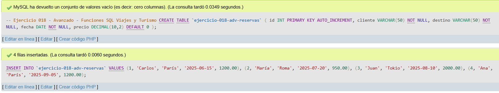
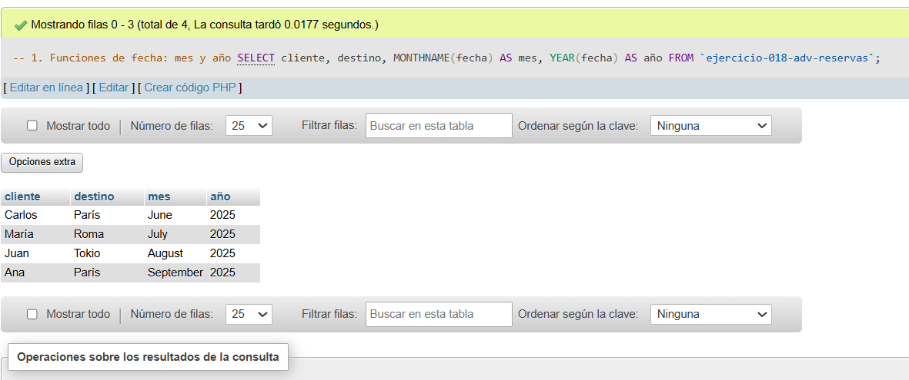
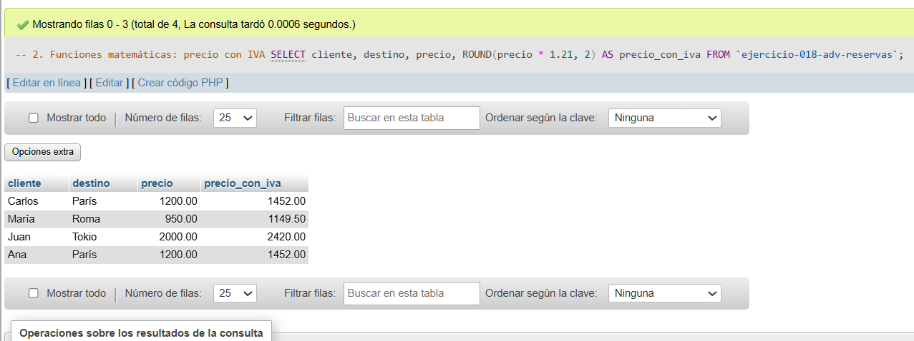
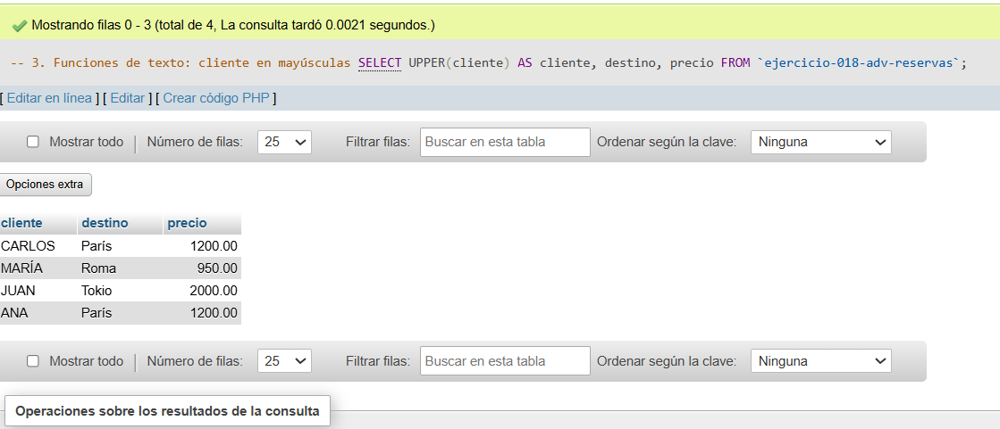

# Ejercicio 018 - Nivel Avanzado - Funciones SQL Viajes y Turismo

## 1. Temática

Viajes y turismo con funciones SQL para manipular fechas, matemáticas y texto.

## 2. Decisiones Técnicas

- **Diseño de Tablas (DDL):**
  - Una tabla: `ejercicio-018-adv-reservas`.
  - Columnas: `id`, `cliente`, `destino`, `fecha`, `precio`.
  - PRIMARY KEY en `id` con AUTO_INCREMENT.
  - Uso de comillas invertidas para nombres con guiones.

- **Inserción de Datos (DML):**
  - 4 reservas con diferentes fechas y precios.

- **Consultas (DQL):**
  - La consulta `1` usa funciones de fecha (`MONTHNAME`, `YEAR`).
  - La consulta `2` usa funciones matemáticas (`ROUND` para calcular IVA).
  - La consulta `3` usa funciones de texto (`UPPER` para mayúsculas).

## 3. Evidencias

<!-- Capturas aquí -->

*A continuación, se adjuntan capturas de pantalla que demuestran la ejecución y los resultados de los scripts SQL en phpMyAdmin.*

Definición de tablas e inserción de datos

Consulta 1

Consulta 2

Consulta 3

