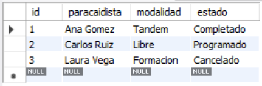
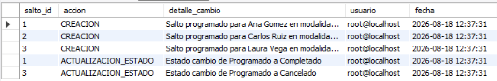

# Ejercicio Avanzado 019 - Triggers (Disparadores)

**Camper:** Antonio Canux

## Descripción

Decimonoveno ejercicio de nivel avanzado, aplicado a un módulo de datos de paracaidismo. El objetivo técnico central es dominar la creación de **Triggers (Disparadores)** en MySQL. A nivel profesional, los Triggers son piezas de código SQL que se ejecutan ("disparan") automáticamente *antes* (`BEFORE`) o *después* (`AFTER`) de que ocurra un evento de modificación (`INSERT`, `UPDATE`, `DELETE`) en una tabla específica. Son ideales para mantener bitácoras de auditoría silenciosas y para forzar reglas de negocio estrictas en la capa de datos.

---

## Tablas y Triggers utilizados

**avanzado_ejercicio_019_saltos**
- id (PK)
- paracaidista
- modalidad
- altitud_pies
- estado (ENUM)
- fecha_salto

**avanzado_ejercicio_019_auditoria**
- id (PK)
- salto_id
- accion
- detalle_cambio
- usuario
- fecha_registro

**Triggers Implementados:**
1. `trg_avanz_019_after_insert`: Se dispara `AFTER INSERT`. Inserta un registro en auditoría al programar un nuevo salto.
2. `trg_avanz_019_before_update`: Se dispara `BEFORE UPDATE`. Bloquea la transacción si se intenta retroceder un salto 'Completado' o 'Cancelado' a 'Programado'.
3. `trg_avanz_019_after_update`: Se dispara `AFTER UPDATE`. Inserta un registro en auditoría indicando el cambio de estado exacto (de X a Y).

---

## Consultas de Ejecución

### 1. ¿Cuál es el estado actual de los saltos tras aplicar el DML?

```sql
SELECT id, paracaidista, modalidad, estado 
    FROM avanzado_ejercicio_019_saltos
    ORDER BY id ASC;
```

**Resultado**



---

### 2. ¿Cómo lucen los registros automáticos en la tabla de auditoría generados por los Triggers?

```sql
SELECT salto_id, accion, detalle_cambio, usuario, DATE_FORMAT(fecha_registro, '%Y-%m-%d %H:%i:%s') AS fecha 
    FROM avanzado_ejercicio_019_auditoria
    ORDER BY id ASC;
```

**Resultado**



---

### 3. ¿Qué ocurre si intentamos violar la regla de negocio del Trigger `BEFORE UPDATE`?

```sql
/*
UPDATE avanzado_ejercicio_019_saltos SET estado = 'Programado' WHERE id = 1;
-- ERROR 1644 (45000): Error: No se puede retroceder un salto Completado o Cancelado a Programado.
*/
```

*(Nota técnica: Este comportamiento asegura la consistencia de los datos, previniendo alteraciones ilógicas del flujo del negocio desde cualquier interfaz).*

---

## Herramientas

- MySQL
- MySQL Workbench
- Git
- GitHub

---

**Campuslands · Skill SQL**