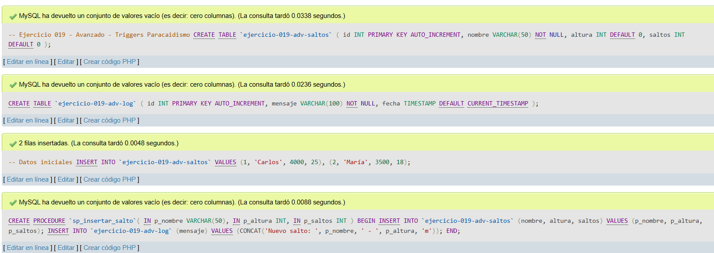
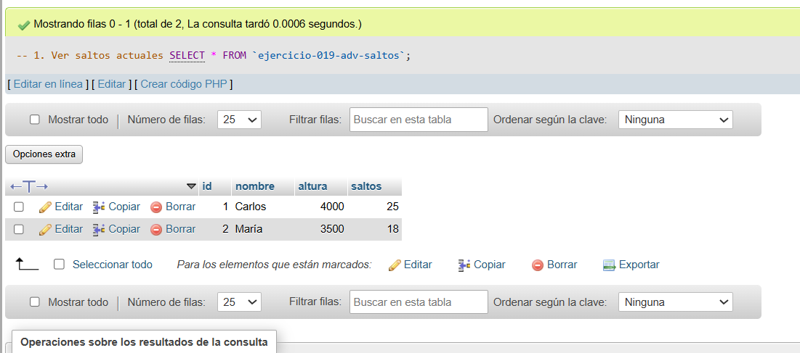
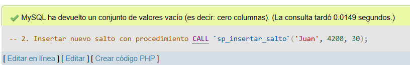
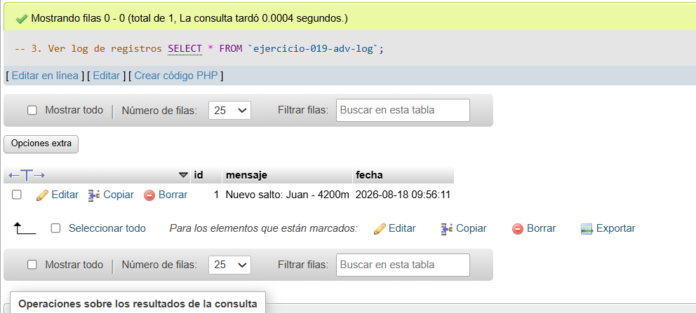

# Ejercicio 019 - Nivel Avanzado - Triggers Paracaidismo

## 1. Temática

Paracaidismo con procedimiento almacenado para insertar saltos y registrar en log.

## 2. Decisiones Técnicas

- **Diseño de Tablas (DDL):**
  - Tabla de saltos: `ejercicio-019-adv-saltos`.
  - Tabla de log: `ejercicio-019-adv-log`.
  - Uso de comillas invertidas para nombres con guiones.

- **Inserción de Datos (DML):**
  - 2 saltos iniciales.
  - Procedimiento `sp_insertar_salto` que inserta en ambas tablas.

- **Consultas (DQL):**
  - La consulta `1` muestra saltos actuales.
  - La consulta `2` inserta un nuevo salto usando el procedimiento.
  - La consulta `3` muestra el log con el registro automático.

## 3. Evidencias

<!-- Capturas aquí -->

*A continuación, se adjuntan capturas de pantalla que demuestran la ejecución y los resultados de los scripts SQL en phpMyAdmin.*

Definición de tablas e inserción de datos

Consulta 1

Consulta 2

Consulta 3

