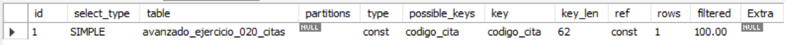
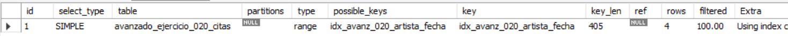
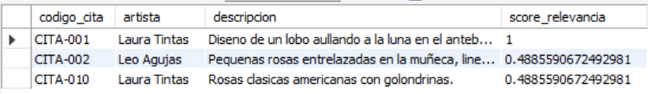
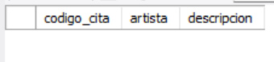
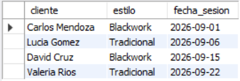

# Ejercicio Avanzado 020 - Índices (Indexes)

**Camper:** Antonio Canux

## Descripción

Vigésimo ejercicio de nivel avanzado, aplicado a un módulo de datos de un estudio de tatuajes. El objetivo técnico central es dominar la optimización mediante **Índices (`INDEX`)** en MySQL. A nivel profesional, una base de datos sin índices escaneará la tabla completa fila por fila (Full Table Scan) para cada consulta, lo cual colapsa los servidores a medida que los datos crecen. En este ejercicio se implementan tres tipos de índices clave: un **Índice Único** (implícito en la restricción `UNIQUE`), un **Índice Compuesto B-Tree** para optimizar las consultas de agenda (cruzando artista y fecha), y un **Índice FULLTEXT** para habilitar motores de búsqueda de texto difuso dentro de las descripciones de los tatuajes.

---

## Tablas e Índices utilizados

**avanzado_ejercicio_020_citas**
- id (PK)
- codigo_cita (UNIQUE INDEX)
- cliente
- artista
- estilo
- descripcion (FULLTEXT INDEX)
- precio
- fecha_sesion
- `INDEX idx_avanz_020_artista_fecha (artista, fecha_sesion)`

---

## Consultas analíticas realizadas

### 1. ¿Cómo auditar que MySQL está usando el índice `UNIQUE` para buscar una cita específica? (`EXPLAIN`)

```sql
EXPLAIN SELECT cliente, artista, fecha_sesion 
    FROM avanzado_ejercicio_020_citas 
    WHERE codigo_cita = 'CITA-005';
```

**Resultado**



---

### 2. ¿Cómo auditar el plan de ejecución para confirmar el uso de nuestro Índice Compuesto?

```sql
EXPLAIN SELECT cliente, estilo, descripcion 
    FROM avanzado_ejercicio_020_citas 
    WHERE artista = 'Laura Tintas' AND fecha_sesion >= '2026-09-01';
```

**Resultado**



---

### 3. ¿Cómo buscar diseños específicos en las descripciones de manera ultra rápida explotando el `FULLTEXT INDEX`?

```sql
SELECT codigo_cita, artista, descripcion, 
           MATCH(descripcion) AGAINST('rosas lobo' IN NATURAL LANGUAGE MODE) AS score_relevancia
    FROM avanzado_ejercicio_020_citas
    WHERE MATCH(descripcion) AGAINST('rosas lobo' IN NATURAL LANGUAGE MODE)
    ORDER BY score_relevancia DESC;
```

**Resultado**



---

### 4. ¿Cómo utilizar el modo booleano del índice de texto para forzar o excluir palabras clave en los tatuajes?

```sql
SELECT codigo_cita, artista, descripcion
    FROM avanzado_ejercicio_020_citas
    WHERE MATCH(descripcion) AGAINST('+mandalas -craneo' IN BOOLEAN MODE);
```

**Resultado**



---

### 5. ¿Cuál es la agenda de citas de un artista ordenadas cronológicamente (aprovechando el índice compuesto `artista_fecha`)?

```sql
SELECT cliente, estilo, fecha_sesion 
    FROM avanzado_ejercicio_020_citas 
    WHERE artista = 'Laura Tintas' 
    ORDER BY fecha_sesion ASC;
```

**Resultado**



---

## Herramientas

- MySQL
- MySQL Workbench
- Git
- GitHub

---

**Campuslands · Skill SQL**