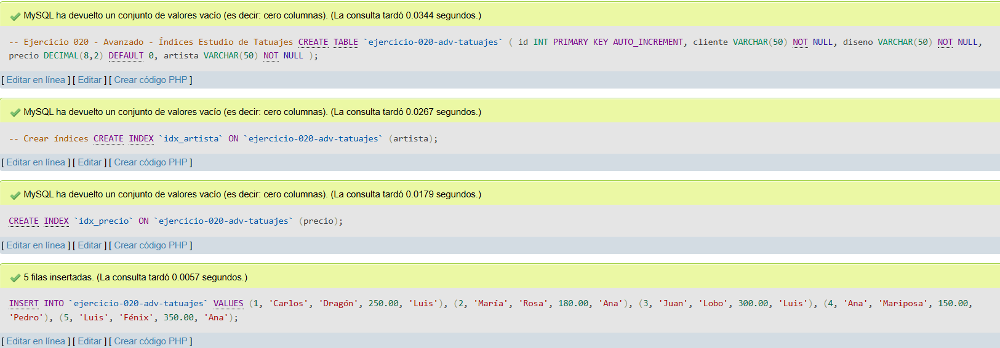
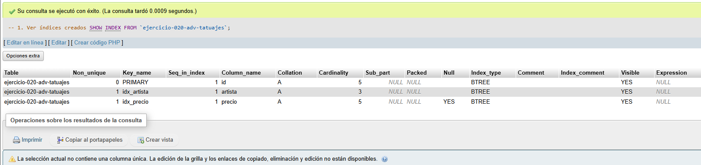
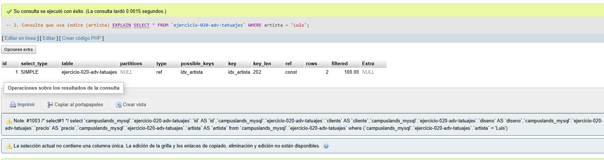
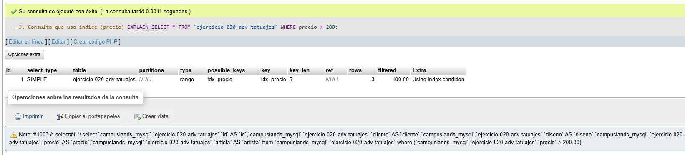

# Ejercicio 020 - Nivel Avanzado - Índices Estudio de Tatuajes

## 1. Temática

Estudio de tatuajes con índices para optimizar consultas frecuentes.

## 2. Decisiones Técnicas

- **Diseño de Tablas (DDL):**
  - Una tabla: `ejercicio-020-adv-tatuajes`.
  - Columnas: `id`, `cliente`, `diseno`, `precio`, `artista`.
  - PRIMARY KEY en `id` con AUTO_INCREMENT.
  - Índices en `artista` y `precio`.
  - Uso de comillas invertidas para nombres con guiones.

- **Inserción de Datos (DML):**
  - 5 tatuajes con diferentes artistas y precios.

- **Consultas (DQL):**
  - La consulta `1` muestra los índices creados con SHOW INDEX.
  - La consulta `2` usa EXPLAIN para ver el uso del índice `idx_artista`.
  - La consulta `3` usa EXPLAIN para ver el uso del índice `idx_precio`.

## 3. Evidencias

<!-- Capturas aquí -->

*A continuación, se adjuntan capturas de pantalla que demuestran la ejecución y los resultados de los scripts SQL en phpMyAdmin.*

Definición de tablas e inserción de datos

Consulta 1

Consulta 2

Consulta 3

