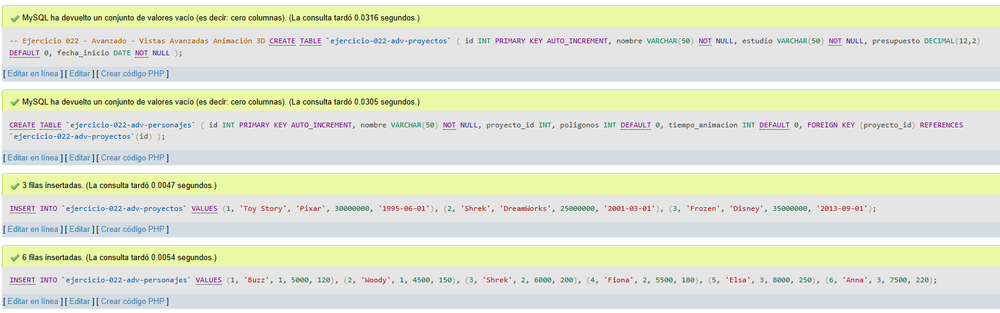
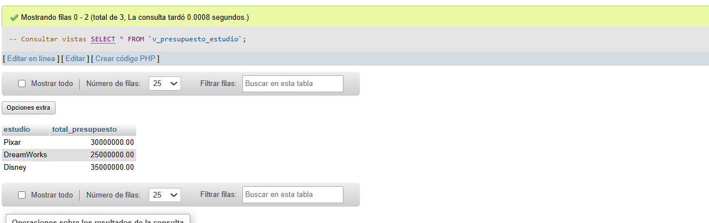
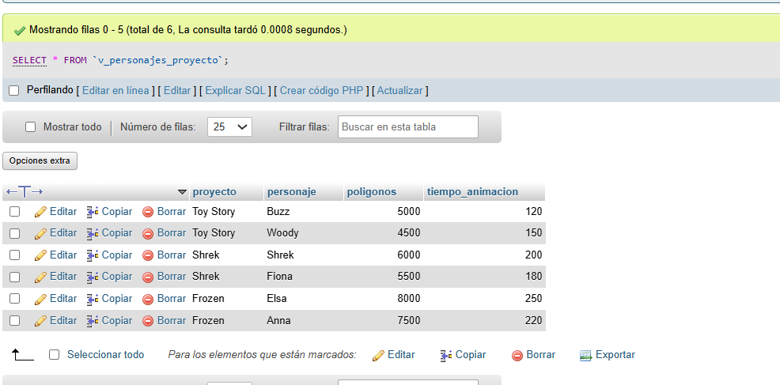
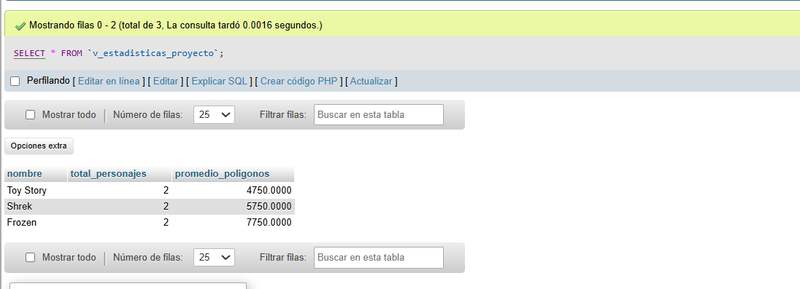

# Ejercicio 022 - Nivel Avanzado - Vistas Avanzadas Animación 3D

## 1. Temática

Animación 3D con vistas avanzadas para análisis de proyectos y personajes.

## 2. Decisiones Técnicas

- **Diseño de Tablas (DDL):**
  - Tabla de proyectos: `ejercicio-022-adv-proyectos`.
  - Tabla de personajes: `ejercicio-022-adv-personajes`.
  - FOREIGN KEY en `proyecto_id` → `proyectos(id)`.
  - Uso de comillas invertidas para nombres con guiones.

- **Inserción de Datos (DML):**
  - 3 proyectos de estudio animación.
  - 6 personajes relacionados.

- **Vistas creadas:**
  - `v_presupuesto_estudio`: Total presupuesto por estudio.
  - `v_personajes_proyecto`: Personajes con su proyecto.
  - `v_estadisticas_proyecto`: Estadísticas por proyecto.

- **Consultas (DQL):**
  - Consultas SELECT desde las vistas creadas.

## 3. Evidencias

<!-- Capturas aquí -->

*A continuación, se adjuntan capturas de pantalla que demuestran la ejecución y los resultados de los scripts SQL en phpMyAdmin.*

Definición de tablas e inserción de datos

Vista 1

Vista 2

Vista 3

