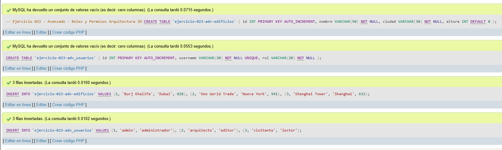
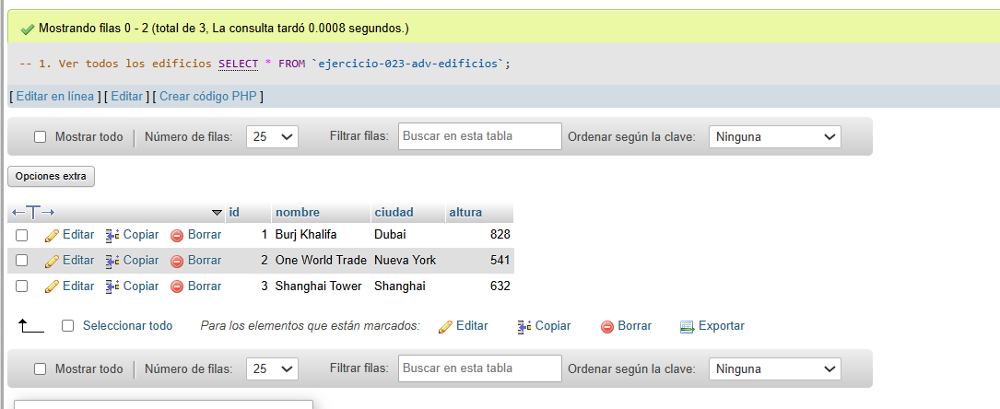
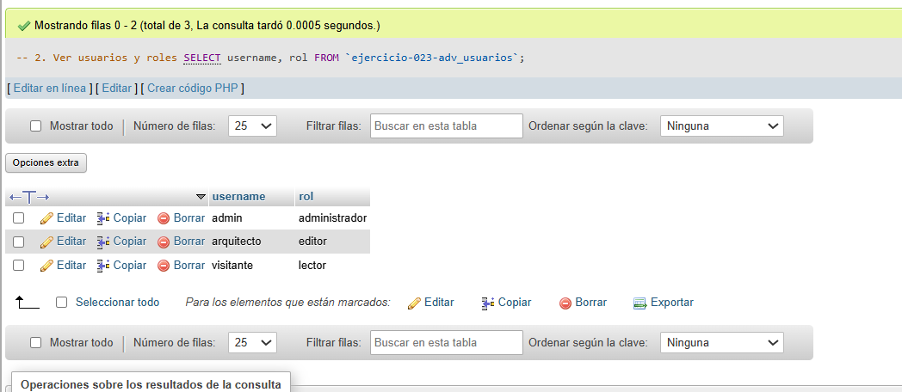
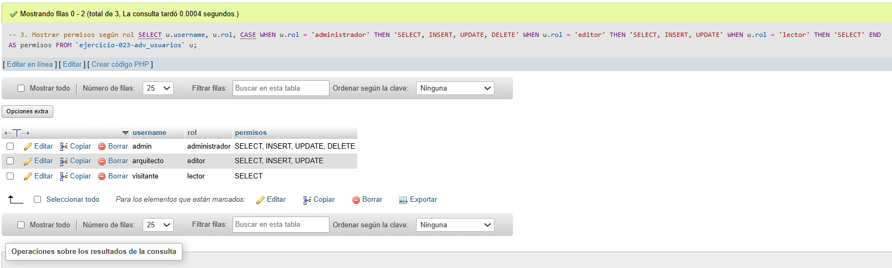

# Ejercicio 023 - Nivel Avanzado - Roles y Permisos Arquitectura 3D

## 1. Temática

Arquitectura 3D con roles y permisos usando tablas de usuarios (sin CREATE USER).

## 2. Decisiones Técnicas

- **Diseño de Tablas (DDL):**
  - Tabla de edificios: `ejercicio-023-adv-edificios`.
  - Tabla de usuarios: `ejercicio-023-adv_usuarios`.
  - Uso de comillas invertidas para nombres con guiones.

- **Inserción de Datos (DML):**
  - 3 edificios.
  - 3 usuarios con diferentes roles.

- **Roles definidos:**
  - **administrador:** Todos los permisos.
  - **editor:** SELECT, INSERT, UPDATE.
  - **lector:** Solo SELECT.

- **Consultas (DQL):**
  - La consulta `1` muestra todos los edificios.
  - La consulta `2` muestra usuarios con sus roles.
  - La consulta `3` muestra permisos según el rol usando CASE.

## 3. Evidencias

<!-- Capturas aquí -->

*A continuación, se adjuntan capturas de pantalla que demuestran la ejecución y los resultados de los scripts SQL en phpMyAdmin.*

Definición de tablas e inserción de datos

Consulta 1

Consulta 2

Consulta 3

