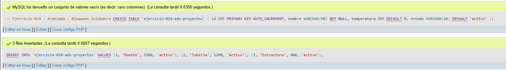
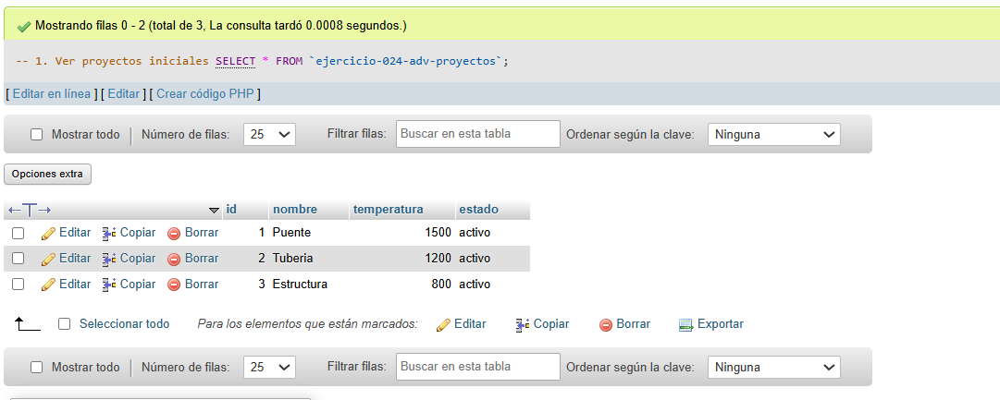
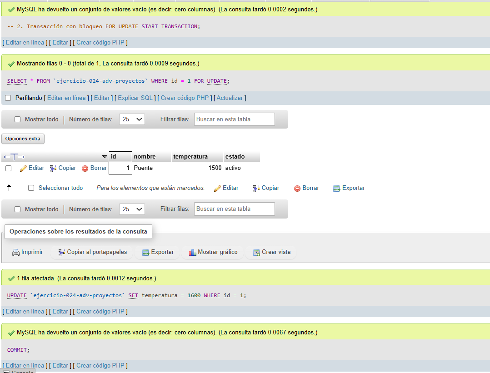
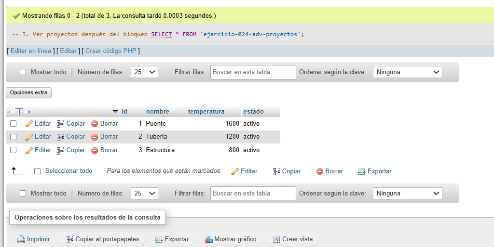

# Ejercicio 024 - Nivel Avanzado - Bloqueos Soldadura

## 1. Temática

Soldadura con bloqueos FOR UPDATE para control de concurrencia.

## 2. Decisiones Técnicas

- **Diseño de Tablas (DDL):**
  - Una tabla: `ejercicio-024-adv-proyectos`.
  - Columnas: `id`, `nombre`, `temperatura`, `estado`.
  - PRIMARY KEY en `id` con AUTO_INCREMENT.
  - Uso de comillas invertidas para nombres con guiones.

- **Inserción de Datos (DML):**
  - 3 proyectos activos.

- **Bloqueo usado:**
  - `FOR UPDATE`: Bloquea la fila para evitar modificaciones concurrentes.
  - Transacción con START TRANSACTION y COMMIT.

- **Consultas (DQL):**
  - La consulta `1` muestra proyectos iniciales.
  - La consulta `2` bloquea una fila, actualiza y confirma.
  - La consulta `3` muestra proyectos después del bloqueo.

## 3. Evidencias

<!-- Capturas aquí -->

*A continuación, se adjuntan capturas de pantalla que demuestran la ejecución y los resultados de los scripts SQL en phpMyAdmin.*

Definición de tablas e inserción de datos

Consulta 1

Consulta 2

Consulta 3

