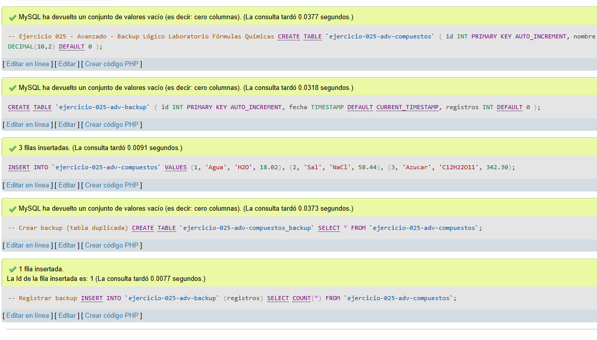
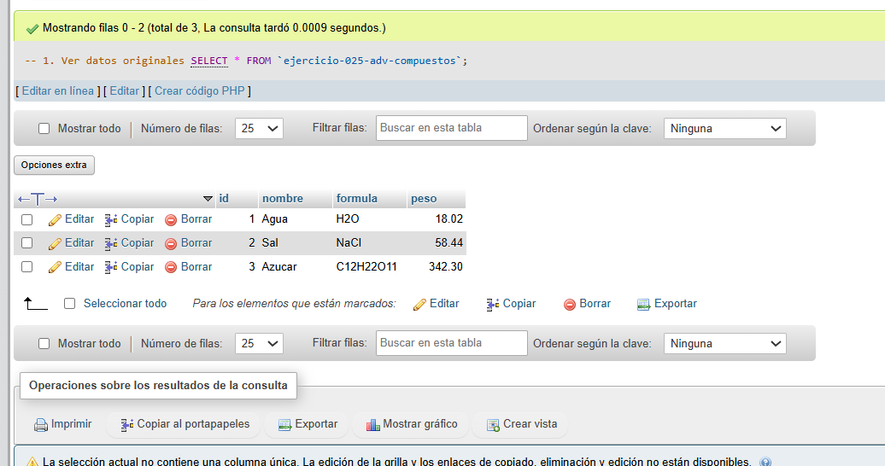
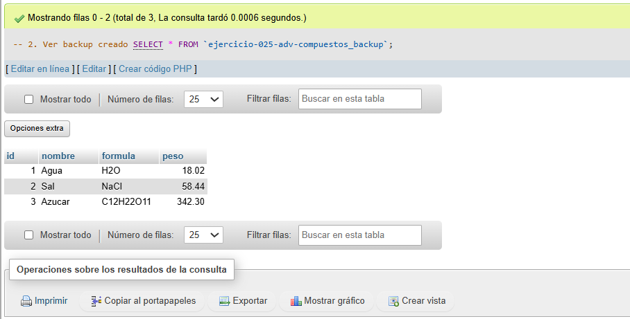
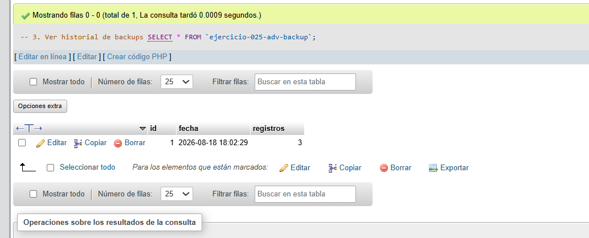

# Ejercicio 025 - Nivel Avanzado - Backup Lógico Laboratorio Fórmulas Químicas

## 1. Temática

Laboratorio de fórmulas químicas con backup lógico usando tablas duplicadas.

## 2. Decisiones Técnicas

- **Diseño de Tablas (DDL):**
  - Tabla principal: `ejercicio-025-adv-compuestos`.
  - Tabla de backup: `ejercicio-025-adv-backup` para historial.
  - Uso de comillas invertidas para nombres con guiones.

- **Método de backup:**
  - `CREATE TABLE ... SELECT`: Copia exacta de datos.
  - Registro en tabla de historial.

- **Inserción de Datos (DML):**
  - 3 compuestos iniciales.
  - Backup creado y registrado.

- **Consultas (DQL):**
  - La consulta `1` muestra datos originales.
  - La consulta `2` muestra el backup creado.
  - La consulta `3` muestra el historial de backups.

## 3. Evidencias

<!-- Capturas aquí -->

*A continuación, se adjuntan capturas de pantalla que demuestran la ejecución y los resultados de los scripts SQL en phpMyAdmin.*

Definición de tablas e inserción de datos

Consulta 1

Consulta 2

Consulta 3

