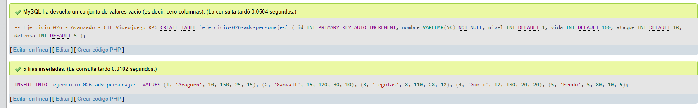
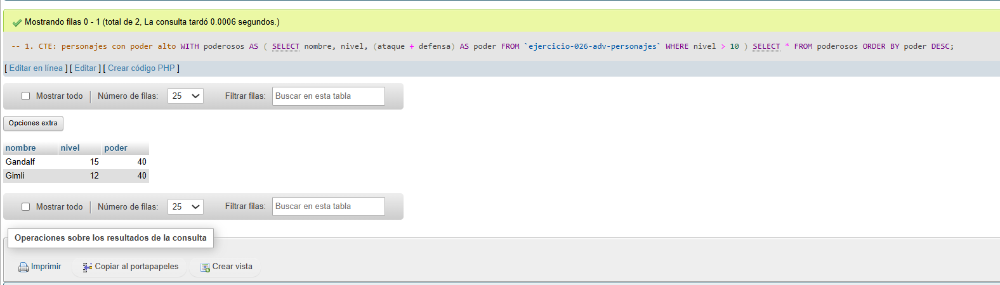
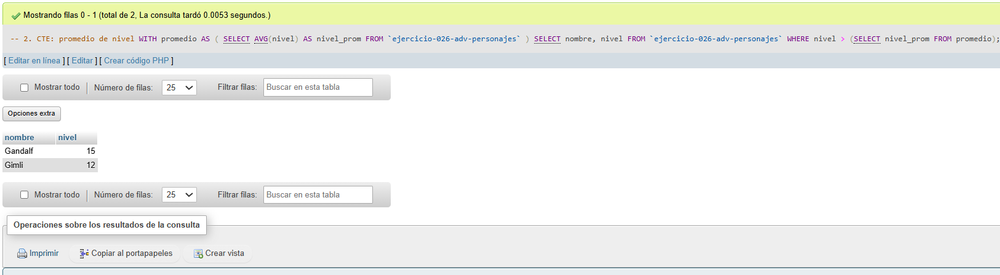
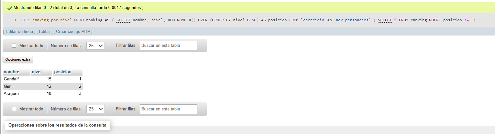

# Ejercicio 026 - Nivel Avanzado - CTE Videojuego RPG

## 1. Temática

Videojuego RPG con Common Table Expressions para análisis avanzado.

## 2. Decisiones Técnicas

- **Diseño de Tablas (DDL):**
  - Una tabla: `ejercicio-026-adv-personajes`.
  - Columnas: `id`, `nombre`, `nivel`, `vida`, `ataque`, `defensa`.
  - PRIMARY KEY en `id` con AUTO_INCREMENT.
  - Uso de comillas invertidas para nombres con guiones.

- **Inserción de Datos (DML):**
  - 5 personajes con diferentes estadísticas.

- **Consultas (DQL) - CTE:**
  - La consulta `1` usa CTE para filtrar personajes poderosos.
  - La consulta `2` usa CTE con subconsulta para promedio de nivel.
  - La consulta `3` usa CTE con ROW_NUMBER para ranking.

## 3. Evidencias

<!-- Capturas aquí -->

*A continuación, se adjuntan capturas de pantalla que demuestran la ejecución y los resultados de los scripts SQL en phpMyAdmin.*

Definición de tablas e inserción de datos

Consulta 1

Consulta 2

Consulta 3

