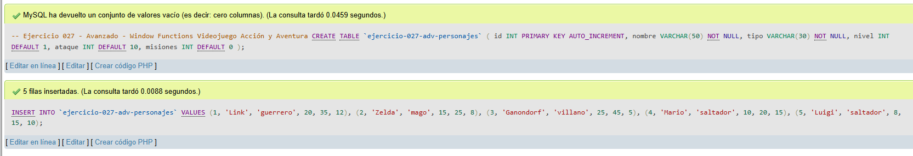
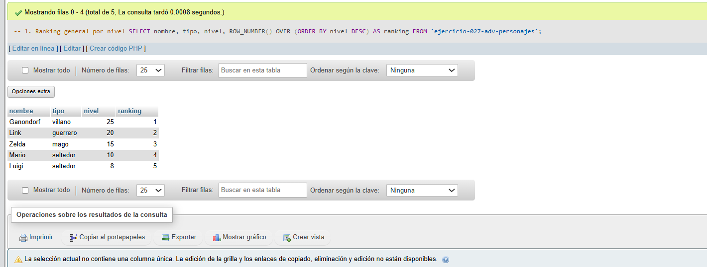
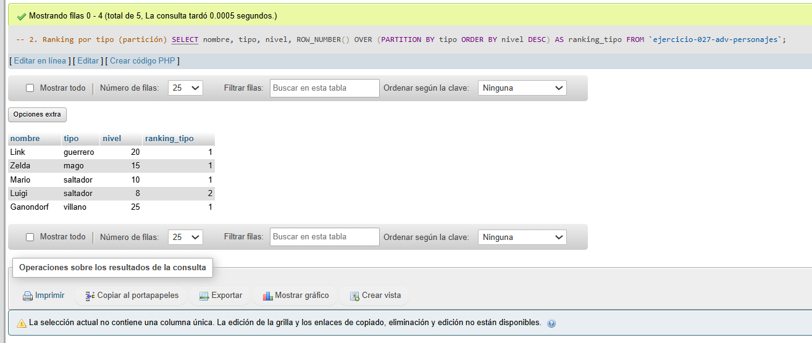
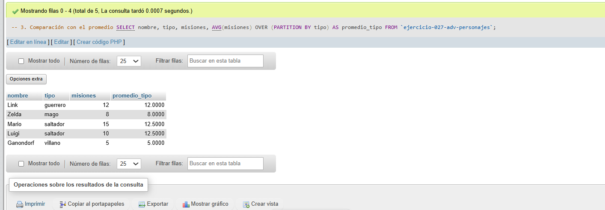

# Ejercicio 027 - Nivel Avanzado - Window Functions Videojuego Acción y Aventura

## 1. Temática

Videojuego de acción y aventura con window functions para análisis avanzado.

## 2. Decisiones Técnicas

- **Diseño de Tablas (DDL):**
  - Una tabla: `ejercicio-027-adv-personajes`.
  - Columnas: `id`, `nombre`, `tipo`, `nivel`, `ataque`, `misiones`.
  - PRIMARY KEY en `id` con AUTO_INCREMENT.
  - Uso de comillas invertidas para nombres con guiones.

- **Inserción de Datos (DML):**
  - 5 personajes con diferentes tipos y estadísticas.

- **Consultas (DQL):**
  - La consulta `1` usa ROW_NUMBER para ranking general.
  - La consulta `2` usa PARTITION BY para ranking por tipo.
  - La consulta `3` usa AVG OVER para comparar con promedio.

## 3. Evidencias

<!-- Capturas aquí -->

*A continuación, se adjuntan capturas de pantalla que demuestran la ejecución y los resultados de los scripts SQL en phpMyAdmin.*

Definición de tablas e inserción de datos

Consulta 1

Consulta 2

Consulta 3

