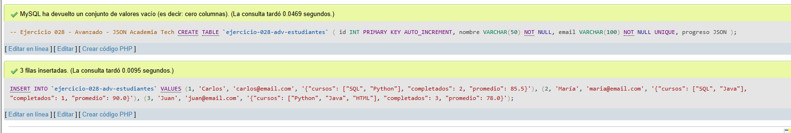
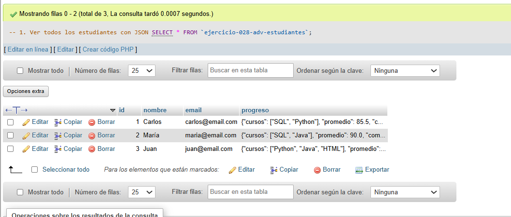
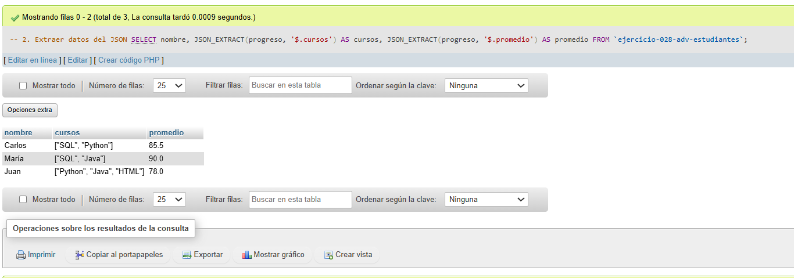
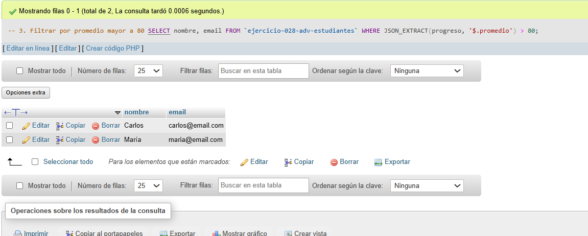

# Ejercicio 028 - Nivel Avanzado - JSON Academia Tech

## 1. Temática

Academia tech con JSON para almacenar progreso de estudiantes.

## 2. Decisiones Técnicas

- **Diseño de Tablas (DDL):**
  - Una tabla: `ejercicio-028-adv-estudiantes`.
  - Columnas: `id`, `nombre`, `email`, `progreso` (tipo JSON).
  - UNIQUE en `email`.
  - PRIMARY KEY en `id` con AUTO_INCREMENT.
  - Uso de comillas invertidas para nombres con guiones.

- **Inserción de Datos (DML):**
  - 3 estudiantes con datos JSON de progreso.
  - Campos JSON: cursos, completados, promedio.

- **Consultas (DQL):**
  - La consulta `1` muestra todos los estudiantes.
  - La consulta `2` extrae datos del JSON con JSON_EXTRACT.
  - La consulta `3` filtra por promedio mayor a 80.

## 3. Evidencias

<!-- Capturas aquí -->

*A continuación, se adjuntan capturas de pantalla que demuestran la ejecución y los resultados de los scripts SQL en phpMyAdmin.*

Definición de tablas e inserción de datos

Consulta 1

Consulta 2

Consulta 3

