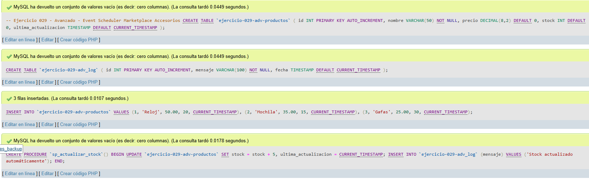
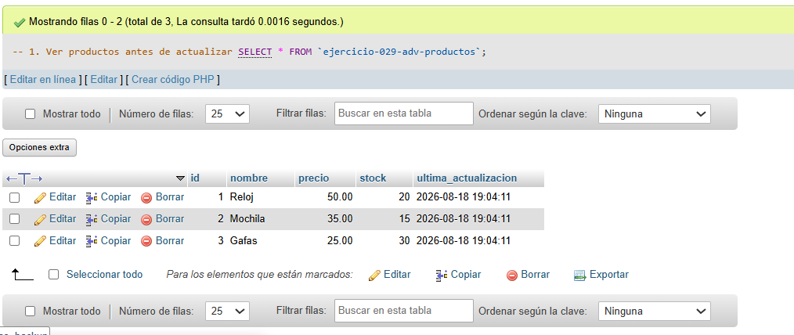
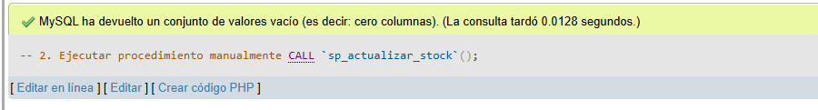
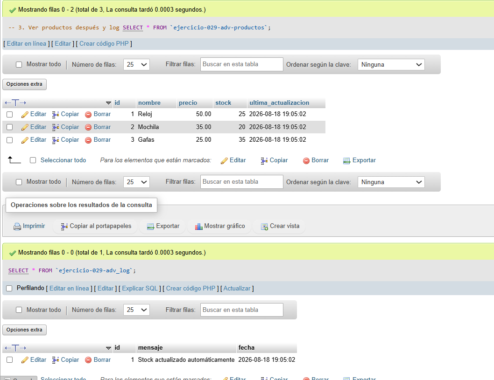

# Ejercicio 029 - Nivel Avanzado - Event Scheduler Marketplace Accesorios

## 1. Temática

Marketplace de accesorios con procedimiento alternativo al event scheduler.

## 2. Decisiones Técnicas

- **Diseño de Tablas (DDL):**
  - Tabla de productos: `ejercicio-029-adv-productos`.
  - Tabla de log: `ejercicio-029-adv_log`.
  - Uso de comillas invertidas para nombres con guiones.

- **Inserción de Datos (DML):**
  - 3 productos con stock inicial.
  - Procedimiento `sp_actualizar_stock` para actualizar stock y registrar.

- **Consultas (DQL):**
  - La consulta `1` muestra productos iniciales.
  - La consulta `2` ejecuta el procedimiento.
  - La consulta `3` muestra productos actualizados y log.

## 3. Evidencias

<!-- Capturas aquí -->

*A continuación, se adjuntan capturas de pantalla que demuestran la ejecución y los resultados de los scripts SQL en phpMyAdmin.*

Definición de tablas e inserción de datos

Consulta 1

Consulta 2

Consulta 3

