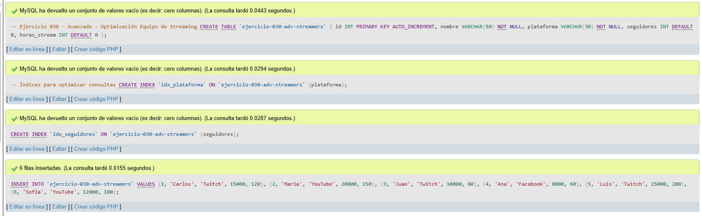
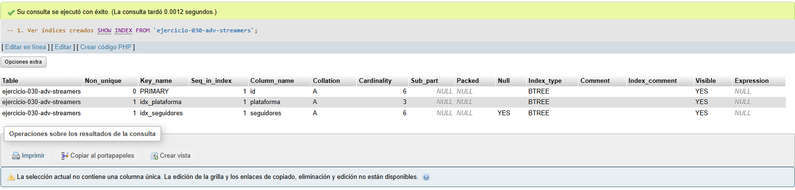
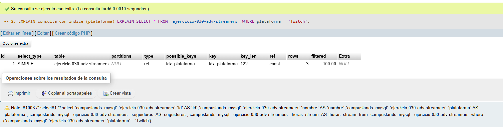
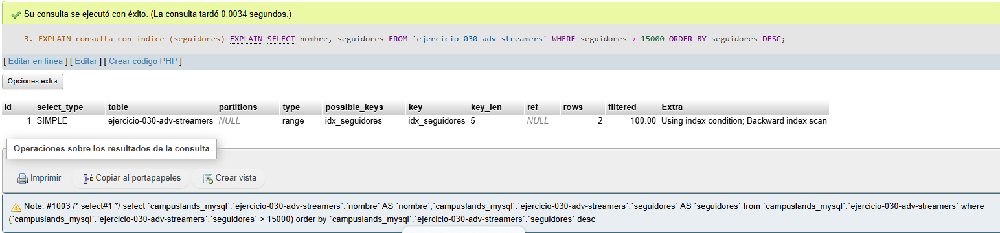

# Ejercicio 030 - Nivel Avanzado - Optimización Equipo de Streaming

## 1. Temática

Equipo de streaming con optimización usando índices para mejorar rendimiento.

## 2. Decisiones Técnicas

- **Diseño de Tablas (DDL):**
  - Una tabla: `ejercicio-030-adv-streamers`.
  - Columnas: `id`, `nombre`, `plataforma`, `seguidores`, `horas_stream`.
  - PRIMARY KEY en `id` con AUTO_INCREMENT.
  - Índices en `plataforma` y `seguidores`.
  - Uso de comillas invertidas para nombres con guiones.

- **Inserción de Datos (DML):**
  - 6 streamers con diferentes plataformas y estadísticas.

- **Consultas (DQL):**
  - La consulta `1` muestra los índices creados.
  - La consulta `2` usa EXPLAIN para analizar consulta con índice `idx_plataforma`.
  - La consulta `3` usa EXPLAIN para analizar consulta con índice `idx_seguidores`.

## 3. Evidencias

<!-- Capturas aquí -->

*A continuación, se adjuntan capturas de pantalla que demuestran la ejecución y los resultados de los scripts SQL en phpMyAdmin.*

Definición de tablas e inserción de datos

Consulta 1

Consulta 2

Consulta 3

