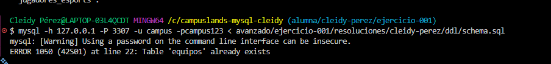
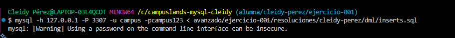
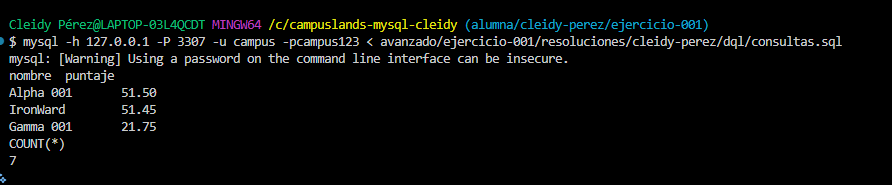

# Resolución Ejercicio 001 - Torneo eSports MOBA

## 🛠️ Decisiones Técnicas

1. **Estructura de la Tabla (`jugadores`)**:
   - `nombre`: Se definió como `UNIQUE` para garantizar que no existan nombres duplicados.
   - `estado`: Se empleó el tipo `ENUM` para restringir únicamente a las 5 posiciones estándar de los juegos MOBA 
  

2. **Diseño de Consultas**:
   - Se incluyeron alias legibles para reportes de negocio.
   - Se calcularon variables derivadas como el **porcentaje de victoria (Winrate)** y agrupaciones por rol y estado.

---

## EVIDENCIA
#### schema


### INSERTAR


### CONSULTAR


## 🚀 Orden de Ejecución

Los scripts deben ejecutarse secuencialmente en el siguiente orden:

```bash
# 1. Crear esquema y tablas
mysql -u campus -pcampus123 campuslands_mysql < ddl/schema.sql

# 2. Insertar registros de prueba
mysql -u campus -pcampus123 campuslands_mysql < dml/inserts.sql

# 3. Ejecutar consultas
mysql -u campus -pcampus123 campuslands_mysql < dql/consultas.sql