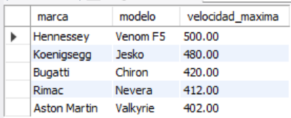
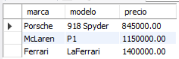
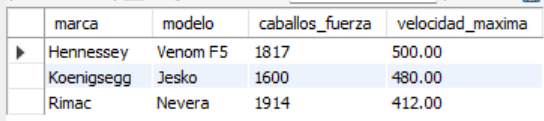

# Ejercicio Básico 006 - Cláusula WHERE

**Camper:** Antonio Canux

## Descripción

Sexto ejercicio de nivel básico, enfocado en un módulo de datos de autos hiperdeportivos. El objetivo principal de esta práctica es dominar el uso de la cláusula `WHERE` en MySQL para el filtrado de registros. A través de operadores relacionales (`>`, `<`), lógicos (`AND`) y especiales (`BETWEEN`, `IN`), extraemos indicadores de negocio precisos sin recurrir a consultas genéricas.

---

## Tabla utilizada

**basico_ejercicio_006**

Campos:

- id (PK)
- marca
- modelo
- caballos_fuerza
- velocidad_maxima
- precio
- estado
- creado_en

---

## Consultas realizadas

### 1. ¿Qué hiperdeportivos actualmente en producción superan los 400 km/h?

```sql
SELECT marca, modelo, velocidad_maxima 
    FROM basico_ejercicio_006 
    WHERE estado = 'produccion' AND velocidad_maxima > 400 
    ORDER BY velocidad_maxima DESC;
```

**Resultado**



---

### 2. ¿Cuáles son los modelos descontinuados cuyo precio es menor a 2,000,000?

```sql
SELECT marca, modelo, precio 
    FROM basico_ejercicio_006 
    WHERE estado = 'descontinuado' AND precio < 2000000 
    ORDER BY precio ASC;
```

**Resultado**



---

### 3. ¿Qué hiperdeportivos ofrecen un balance de potencia entre 1000 y 1500 caballos de fuerza?

```sql
SELECT marca, modelo, caballos_fuerza 
    FROM basico_ejercicio_006 
    WHERE caballos_fuerza 
    BETWEEN 1000 AND 1500;
```

**Resultado**


---

### 4. ¿Cuáles de los vehículos registrados pertenecen a la clásica "Holy Trinity" (Ferrari, McLaren, Porsche)?

```sql
SELECT marca, modelo, precio, caballos_fuerza 
    FROM basico_ejercicio_006 
    WHERE marca IN ('Ferrari', 'McLaren', 'Porsche');
```

**Resultado**


---

### 5. ¿Qué modelos poseen potencia extrema (más de 1500 hp), ordenados de mayor a menor velocidad?

```sql
SELECT marca, modelo, caballos_fuerza, velocidad_maxima 
    FROM basico_ejercicio_006 
    WHERE caballos_fuerza > 1500 
    ORDER BY velocidad_maxima DESC;
```

**Resultado**



---

## Herramientas

- MySQL
- MySQL Workbench
- Git
- GitHub

---

**Campuslands · Skill SQL**