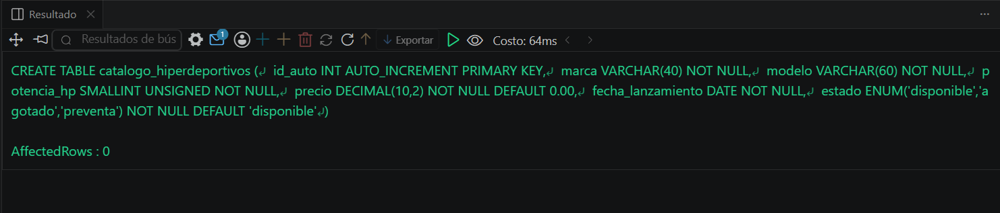
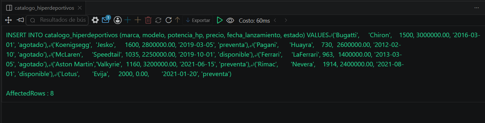
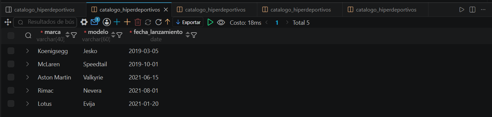

# Resolucion - Ejercicio 006 (Basico) - Selvin Lem

## Tematica
Autos hiperdeportivos

## Como ejecutar
1. Ejecutar `ddl/schema.sql` para crear catalogo_hiperdeportivos.
2. Ejecutar `dml/inserts.sql` para insertar 8 registros de prueba.
3. Ejecutar `dql/consultas.sql` para correr las 5 consultas con WHERE.

## Entidad principal
- Tabla: catalogo_hiperdeportivos
- Atributos clave: marca, modelo, potencia_hp, precio, estado

## Restriccion aplicada
ENUM en estado, restringido a disponible, agotado o preventa.

## Caso limite incluido
Auto con precio en 0.00 (sin confirmar en mercado), usado para
probar un filtro WHERE de dato incompleto.

## Evidencia ejecucion - schema.sql

 

## Evidencia ejecucion - inserts.sql
 

## Evidencia ejecucion - consultas.sql
 