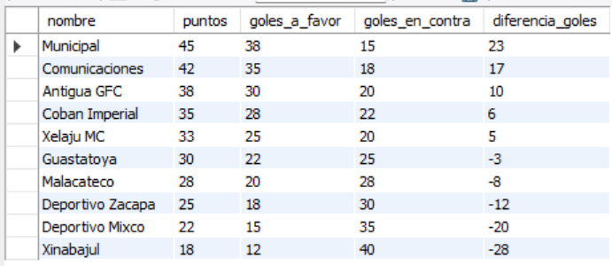
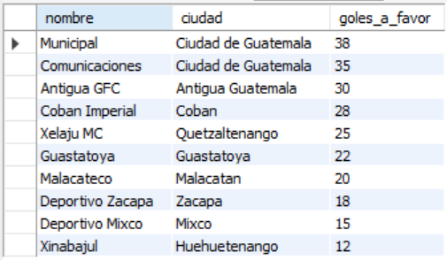
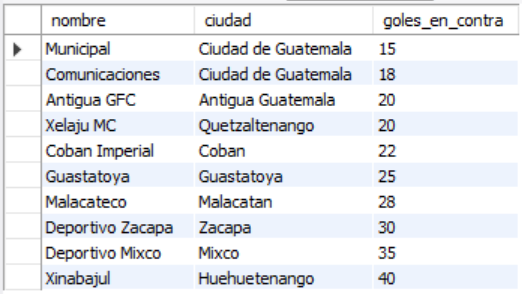
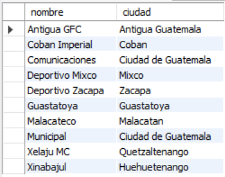
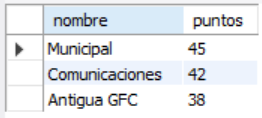

# Ejercicio Básico 007 - Cláusula ORDER BY

**Camper:** Antonio Canux

## Descripción

Séptimo ejercicio de nivel básico, enfocado en un módulo de datos estadísticos para una liga de fútbol. El objetivo de esta práctica es dominar el ordenamiento de resultados mediante la cláusula `ORDER BY` en MySQL. A través de este ejercicio se configuran tablas de posiciones, rankings ofensivos/defensivos y ordenamientos alfabéticos utilizando múltiples criterios y direcciones (`ASC`, `DESC`).

---

## Tabla utilizada

**basico_ejercicio_007**

Campos:

- id (PK)
- nombre
- ciudad
- partidos_jugados
- puntos
- goles_a_favor
- goles_en_contra
- creado_en

---

## Consultas realizadas

### 1. ¿Cómo queda la tabla de posiciones, ordenada por puntos y diferencia de goles?

```sql
SELECT nombre, puntos, goles_a_favor, goles_en_contra, (goles_a_favor - goles_en_contra) AS diferencia_goles 
    FROM basico_ejercicio_007 
    ORDER BY puntos DESC, diferencia_goles DESC;
```

**Resultado**



---

### 2. ¿Cuáles son los equipos más ofensivos del torneo (ordenados por goles a favor)?

```sql
SELECT nombre, ciudad, goles_a_favor 
    FROM basico_ejercicio_007 
    ORDER BY goles_a_favor DESC;
```

**Resultado**



---

### 3. ¿Cuáles son las mejores defensas (ordenados de menor a mayor cantidad de goles recibidos)?

```sql
SELECT nombre, ciudad, goles_en_contra 
    FROM basico_ejercicio_007 
    ORDER BY goles_en_contra ASC;
```

**Resultado**



---

### 4. ¿Cuál es el listado de todos los equipos inscritos ordenado alfabéticamente?

```sql
SELECT nombre, ciudad 
    FROM basico_ejercicio_007 
    ORDER BY nombre ASC;
```

**Resultado**



---

### 5. ¿Cuál es el Top 3 de los mejores equipos del torneo en base a sus puntos?

```sql
SELECT nombre, puntos 
    FROM basico_ejercicio_007 
    ORDER BY puntos DESC LIMIT 3;
```

**Resultado**



---

## Herramientas

- MySQL
- MySQL Workbench
- Git
- GitHub

---

**Campuslands · Skill SQL**