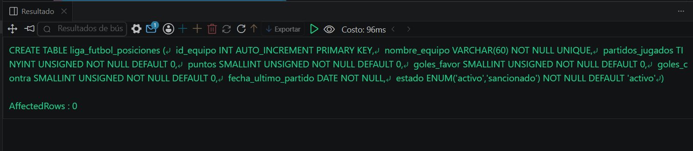
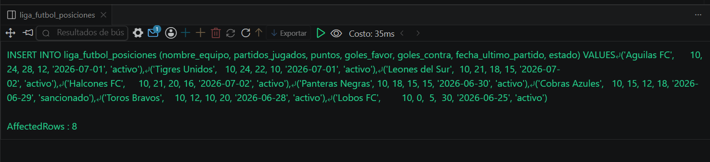
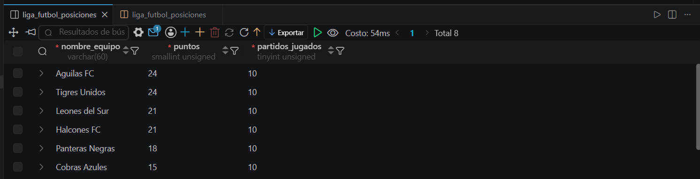

# Resolucion - Ejercicio 007 (Basico) - Selvin Lem

## Tematica
Liga de futbol

## Como ejecutar
1. Ejecutar `ddl/schema.sql` para crear liga_futbol_posiciones.
2. Ejecutar `dml/inserts.sql` para insertar 8 registros de prueba.
3. Ejecutar `dql/consultas.sql` para correr las 5 consultas con ORDER BY.

## Entidad principal
- Tabla: liga_futbol_posiciones
- Atributos clave: nombre_equipo, puntos, goles_favor, goles_contra

## Restriccion aplicada
ENUM en estado, restringido a activo o sancionado.

## Caso limite incluido
Dos equipos empatados en puntos (24), resueltos por un segundo
criterio de ORDER BY (diferencia de gol). Un equipo con 0 puntos
en el ultimo lugar absoluto.

## Evidencia ejecucion - schema.sql
 
 
## Evidencia ejecucion - inserts.sql
 

## Evidencia ejecucion - consultas.sql
 