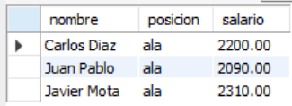
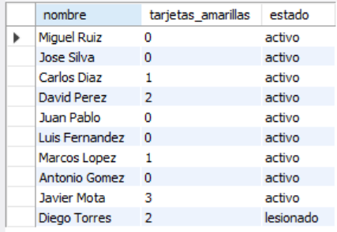

# Ejercicio Básico 008 - Instrucción UPDATE

**Camper:** Antonio Canux

## Descripción

Octavo ejercicio de nivel básico, enfocado en un módulo de datos de un equipo de fútbol sala. A diferencia de las prácticas de solo lectura, el objetivo principal de este ejercicio es dominar la instrucción de modificación `UPDATE` en MySQL. Se aplican actualizaciones de campos únicos, actualizaciones matemáticas relativas (aumentos de salario o incremento de tarjetas), y actualizaciones múltiples bajo condiciones específicas (`WHERE`).

---

## Tabla utilizada

**basico_ejercicio_008**

Campos:

- id (PK)
- nombre
- posicion
- goles
- tarjetas_amarillas
- salario
- estado
- creado_en

---

## Modificaciones realizadas

### 1. ¿Cómo registrar la recuperación de 'Carlos Diaz', cambiando su estado a activo?

```sql
UPDATE basico_ejercicio_008 
    SET estado = 'activo' 
    WHERE nombre = 'Carlos Diaz';
SELECT nombre, estado 
    FROM basico_ejercicio_008 
    WHERE nombre = 'Carlos Diaz';
```

**Resultado**


---

### 2. ¿Cómo aplicar un aumento salarial del 10% a todos los jugadores que son 'ala'?

```sql
UPDATE basico_ejercicio_008 
    SET salario = salario * 1.10 
    WHERE posicion = 'ala';
SELECT nombre, posicion, salario 
    FROM basico_ejercicio_008 
    WHERE posicion = 'ala';
```

**Resultado**



---

### 3. ¿Cómo sumar una tarjeta amarilla a 'Jose Silva' y cambiar su estado a 'suspendido' en la misma instrucción?

```sql
UPDATE basico_ejercicio_008 
    SET tarjetas_amarillas = tarjetas_amarillas + 1, estado = 'suspendido' 
    WHERE nombre = 'Jose Silva';
SELECT nombre, tarjetas_amarillas, estado 
    FROM basico_ejercicio_008 
    WHERE nombre = 'Jose Silva';
```

**Resultado**


---

### 4. ¿Cómo bonificar 300 de salario extra a los 'pivot' que tengan más de 20 goles registrados?

```sql
UPDATE basico_ejercicio_008 
    SET salario = salario + 300 
    WHERE posicion = 'pivot' AND goles > 20;
SELECT nombre, posicion, goles, salario 
    FROM basico_ejercicio_008 
    WHERE posicion = 'pivot';
```

**Resultado**


---

### 5. ¿Cómo limpiar las tarjetas amarillas (poner en 0) y activar a los jugadores que estaban suspendidos?

```sql
UPDATE basico_ejercicio_008 
    SET tarjetas_amarillas = 0, estado = 'activo' 
    WHERE estado = 'suspendido';
SELECT nombre, tarjetas_amarillas, estado 
    FROM basico_ejercicio_008;
```

**Resultado**



---

## Herramientas

- MySQL
- MySQL Workbench
- Git
- GitHub

---

**Campuslands · Skill SQL**