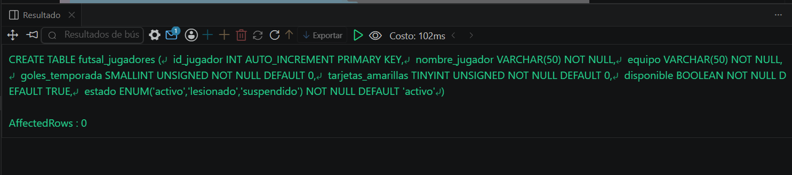
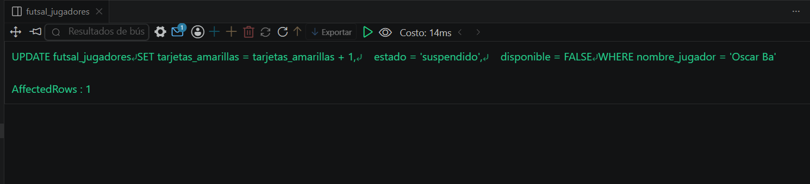
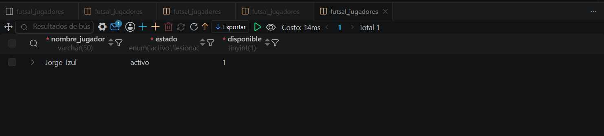

# Resolucion - Ejercicio 008 (Basico) - Selvin Lem

## Tematica
Futbol sala

## Como ejecutar
1. Ejecutar `ddl/schema.sql` para crear futsal_jugadores.
2. Ejecutar `dml/inserts.sql`: inserta 8 jugadores y aplica 3 UPDATE
   (incremento de goles, recuperacion de lesion, suspension por tarjetas).
3. Ejecutar `dql/consultas.sql` para verificar los cambios aplicados.

## Entidad principal
- Tabla: futsal_jugadores
- Atributos clave: nombre_jugador, goles_temporada, tarjetas_amarillas, estado

## Restriccion aplicada
ENUM en estado, restringido a activo, lesionado o suspendido.

## Caso limite incluido
Jugador que acumula su 4ta amarilla; un solo UPDATE actualiza
tarjetas_amarillas, estado y disponible en la misma sentencia.

## Evidencia ejecucion - schema.sql
 

## Evidencia ejecucion - inserts.sql
 
 
## Evidencia ejecucion - consultas.sql
 