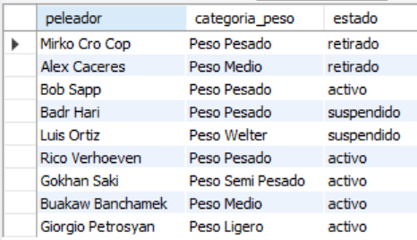
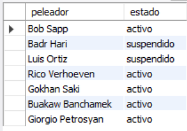
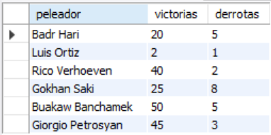
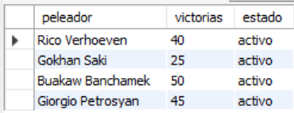

# Ejercicio Básico 009 - Instrucción DELETE (Controlado)

**Camper:** Antonio Canux

## Descripción

Noveno ejercicio de nivel básico, enfocado en un módulo de datos de peleadores de kickboxing. El objetivo fundamental de esta práctica es dominar la instrucción de eliminación `DELETE` en MySQL de forma segura y controlada mediante el uso obligatorio de la cláusula `WHERE`. Se aplican eliminaciones por nombre, por estado y mediante operadores lógicos compuestos, verificando inmediatamente los resultados con consultas `SELECT`.

---

## Tabla utilizada

**basico_ejercicio_009**

Campos:

- id (PK)
- peleador
- categoria_peso
- victorias
- derrotas
- estado
- creado_en

---

## Modificaciones (Eliminaciones) realizadas

### 1. ¿Cómo eliminar el registro específico de 'Juan Perez' y verificar la lista restante?

```sql
DELETE FROM basico_ejercicio_009 
    WHERE peleador = 'Juan Perez';
SELECT peleador, categoria_peso, estado 
    FROM basico_ejercicio_009;
```

**Resultado**



---

### 2. ¿Cómo limpiar la base de datos eliminando a todos los peleadores 'retirados'?

```sql
DELETE FROM basico_ejercicio_009 
    WHERE estado = 'retirado';
SELECT peleador, estado 
    FROM basico_ejercicio_009;
```

**Resultado**



---

### 3. ¿Cómo eliminar a los peleadores con un récord deficiente (más de 5 derrotas y 0 victorias)?

```sql
DELETE FROM basico_ejercicio_009 
    WHERE derrotas > 5 AND victorias = 0;
SELECT peleador, victorias, derrotas 
    FROM basico_ejercicio_009;
```

**Resultado**



---

### 4. ¿Cómo dar de baja a peleadores que están 'suspendidos' dentro de la categoría 'Peso Pesado'?

```sql
DELETE FROM basico_ejercicio_009 
    WHERE categoria_peso = 'Peso Pesado' AND estado = 'suspendido';
SELECT peleador, categoria_peso, estado 
    FROM basico_ejercicio_009 
    WHERE categoria_peso = 'Peso Pesado';
```

**Resultado**


---

### 5. ¿Cómo eliminar a los peleadores con menos de 3 victorias que se encuentren 'suspendidos'?

```sql
DELETE FROM basico_ejercicio_009 
    WHERE victorias < 3 AND estado = 'suspendido';
SELECT peleador, victorias, estado 
    FROM basico_ejercicio_009;
```

**Resultado**



---

## Herramientas

- MySQL
- MySQL Workbench
- Git
- GitHub

---

**Campuslands · Skill SQL**