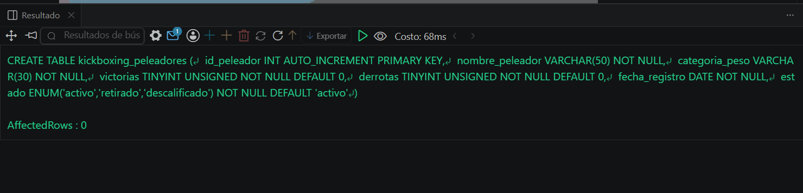
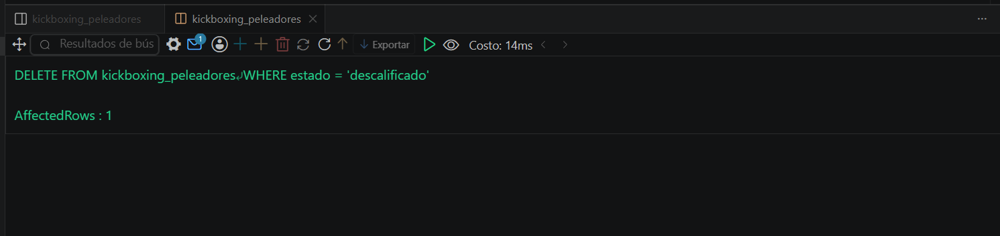
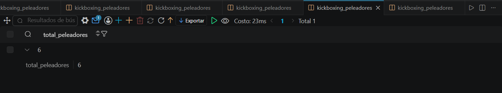

# Resolucion - Ejercicio 009 (Basico) - Selvin Lem

## Tematica
Kickboxing

## Como ejecutar
1. Ejecutar `ddl/schema.sql` para crear kickboxing_peleadores.
2. Ejecutar `dml/inserts.sql`: inserta 8 peleadores, verifica con
   SELECT antes de eliminar, y aplica 2 DELETE controlados.
3. Ejecutar `dql/consultas.sql` para confirmar que los eliminados
   ya no existen y que quedan 6 registros.

## Entidad principal
- Tabla: kickboxing_peleadores
- Atributos clave: nombre_peleador, categoria_peso, victorias, estado

## Restriccion aplicada
ENUM en estado, restringido a activo, retirado o descalificado.

## Caso limite incluido
Cada DELETE se precede de un SELECT con el mismo WHERE, para
confirmar el alcance exacto antes de eliminar (control real, no
solo teorico).

## Evidencia ejecucion - schema.sql
 

## Evidencia ejecucion - inserts.sql
 
 
## Evidencia ejecucion - consultas.sql
 