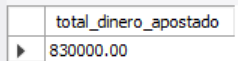
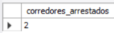
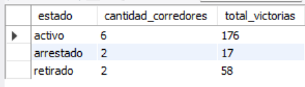
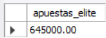

# Ejercicio Básico 010 - COUNT y SUM

**Camper:** Antonio Canux

## Descripción

Décimo ejercicio de nivel básico, enfocado en un módulo de datos de carreras urbanas. El objetivo principal de esta práctica es utilizar las funciones de agregación `COUNT` y `SUM` en MySQL para extraer métricas absolutas. A través de este ejercicio, contamos registros bajo condiciones específicas y sumamos valores financieros y estadísticos para obtener indicadores directos del negocio.

---

## Tabla utilizada

**basico_ejercicio_010**

Campos:

- id (PK)
- corredor
- vehiculo
- carreras_ganadas
- dinero_apostado
- estado
- creado_en

---

## Consultas realizadas

### 1. ¿Cuál es la suma total de dinero apostado por todos los corredores en las calles?

```sql
SELECT SUM(dinero_apostado) AS total_dinero_apostado 
    FROM basico_ejercicio_010;
```

**Resultado**



---

### 2. ¿Cuántos corredores se encuentran actualmente arrestados?

```sql
SELECT COUNT(id) AS corredores_arrestados 
    FROM basico_ejercicio_010 
    WHERE estado = 'arrestado';
```

**Resultado**



---

### 3. ¿Cuál es el total de carreras ganadas y la cantidad de corredores, agrupados por su estado actual?

```sql
SELECT estado, COUNT(id) AS cantidad_corredores, SUM(carreras_ganadas) AS total_victorias 
    FROM basico_ejercicio_010 
    GROUP BY estado;
```

**Resultado**



---

### 4. ¿Cuánto dinero en total ha sido apostado por la élite (corredores con más de 20 victorias)?

```sql
SELECT SUM(dinero_apostado) AS apuestas_elite 
    FROM basico_ejercicio_010 
    WHERE carreras_ganadas > 20;
```

**Resultado**



---

### 5. ¿Cuántos corredores en estado activo mantienen un perfil de alto riesgo (apuestas sobre 50,000)?

```sql
SELECT COUNT(id) AS corredores_alto_riesgo 
    FROM basico_ejercicio_010 
    WHERE estado = 'activo' 
    AND dinero_apostado > 50000;
```

**Resultado**


---

## Herramientas

- MySQL
- MySQL Workbench
- Git
- GitHub

---

**Campuslands · Skill SQL**