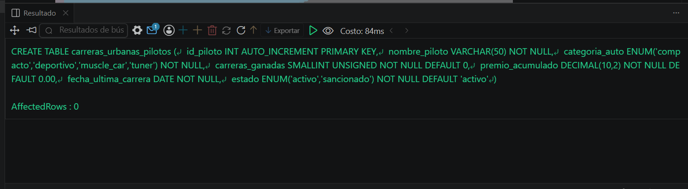
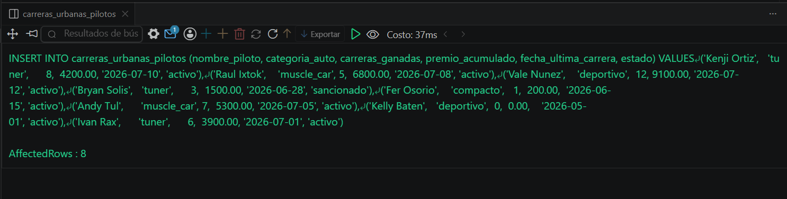
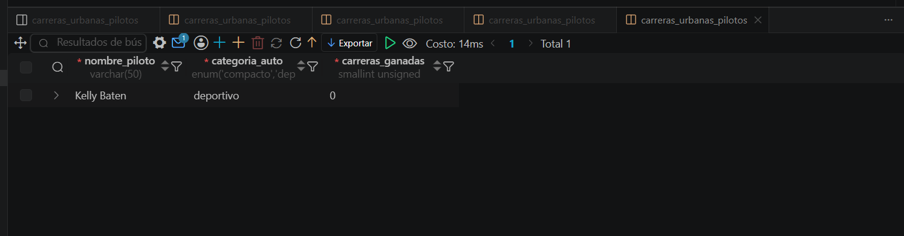

# Resolucion - Ejercicio 010 (Basico) - Selvin Lem

## Tematica
Carreras urbanas

## Como ejecutar
1. Ejecutar `ddl/schema.sql` para crear carreras_urbanas_pilotos.
2. Ejecutar `dml/inserts.sql` para insertar 8 registros de prueba.
3. Ejecutar `dql/consultas.sql` para correr las 5 consultas con
   COUNT y SUM.

## Entidad principal
- Tabla: carreras_urbanas_pilotos
- Atributos clave: nombre_piloto, categoria_auto, carreras_ganadas, premio_acumulado

## Restriccion aplicada
ENUM en categoria_auto y estado, restringidos a valores validos.

## Caso limite incluido
Piloto con 0 carreras ganadas y 0.00 de premio acumulado, incluido
en los calculos de SUM y COUNT sin distorsionar los totales.

## Evidencia ejecucion - schema.sql
 

## Evidencia ejecucion - inserts.sql
 
 
## Evidencia ejecucion - consultas.sql
 