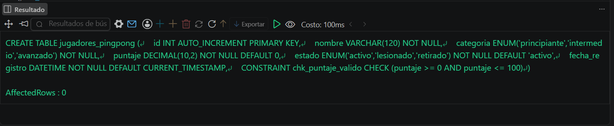
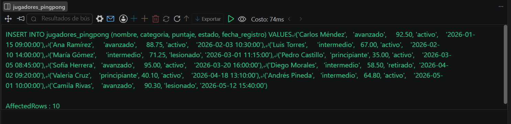
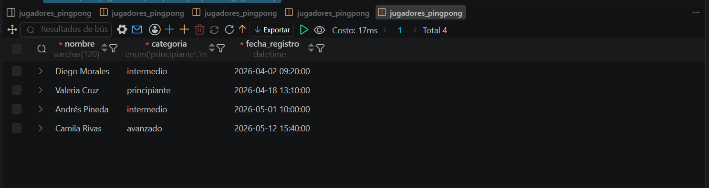

# Resolucion - Ejercicio 011 (Basico)

## Tematica
Pingpong

## Como ejecutar
1. Ejecutar `ddl/schema.sql` para crear pingpong_validaciones.
2. Ejecutar `dml/inserts.sql` para insertar 10 registros de prueba.
3. Ejecutar `dql/consultas.sql` para correr las 5 consultas con
   COUNT, AVG y filtros por fecha.

## Entidad principal
- Tabla: jugadores_pingpong
- Atributos clave: nombre, categoria, puntaje, estado

## Restriccion aplicada
CHECK en puntaje (rango 0 a 100) y ENUM en categoria y estado,
restringidos a valores validos.

## Caso limite incluido
Jugador principiante con puntaje bajo (35.00) y jugadores en estado
lesionado/retirado, incluidos en los calculos de AVG y COUNT sin
distorsionar los totales.

## Evidencia ejecucion - schema.sql
 

## Evidencia ejecucion - inserts.sql
 
 
## Evidencia ejecucion - consultas.sql
 