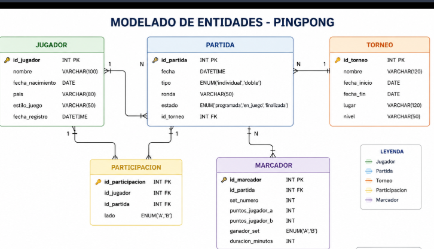

## Ejercicio 012

## Descripcion
 Uso de modelado de entidades para una mejor optimizacíon de la base de datos, las cuales ayuda a identificar cuales son los datos que aun pueden ser atomicos.

 Ejemplo: 

 