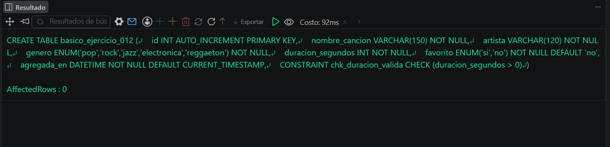
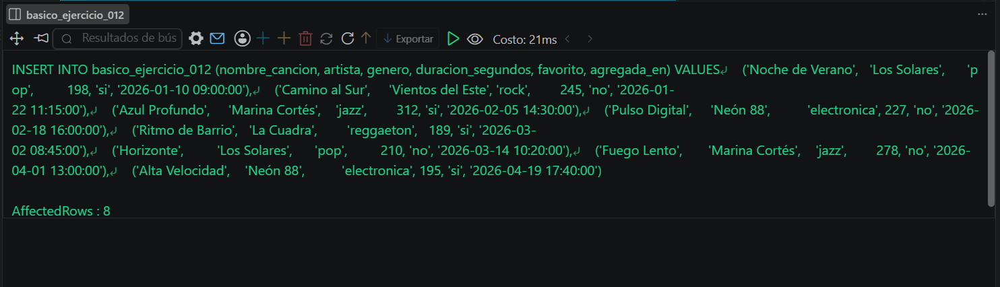
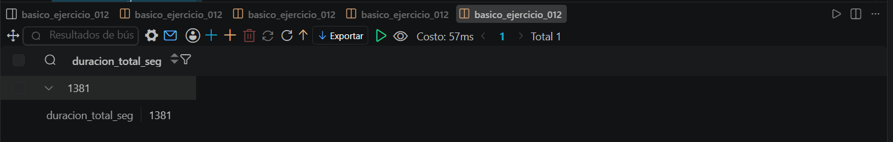

# Resolucion - Ejercicio 012 (Basico) - Selvin Lem

## Tematica
Playlist musical

## Como ejecutar
1. Ejecutar `ddl/schema.sql` para crear basico_ejercicio_012.
2. Ejecutar `dml/inserts.sql` para insertar 8 registros de prueba.
3. Ejecutar `dql/consultas.sql` para correr las 5 consultas con
   COUNT, AVG y SUM.

## Entidad principal
- Tabla: basico_ejercicio_012
- Atributos clave: nombre_cancion, artista, genero, duracion_segundos

## Restriccion aplicada
CHECK en duracion_segundos (mayor a 0) y ENUM en genero y favorito,
restringidos a valores validos.

## Caso limite incluido
Cancion de jazz con duracion mayor al resto (312 segundos) y varias
canciones no favoritas, incluidas en los calculos de AVG y SUM sin
distorsionar los totales.

## Evidencia ejecucion - schema.sql
 

## Evidencia ejecucion - inserts.sql
 
 
## Evidencia ejecucion - consultas.sql
 