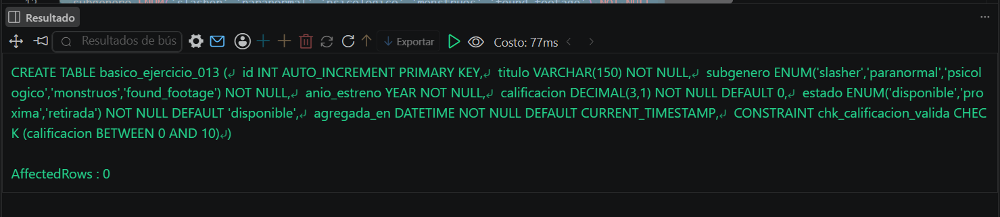
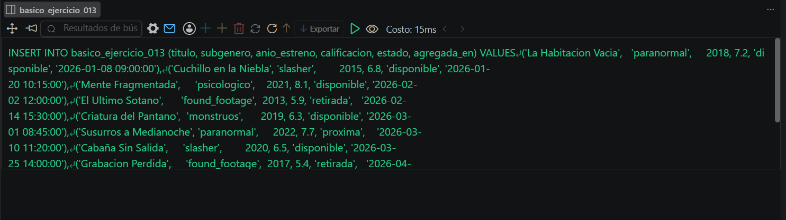
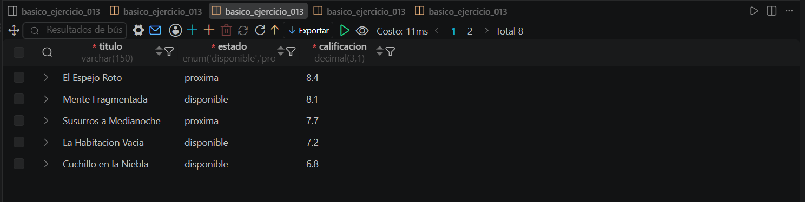

# Resolucion - Ejercicio 013 (Basico) - Selvin Lem

## Tematica
Catalogo de peliculas de miedo

## Como ejecutar
1. Ejecutar `ddl/schema.sql` para crear basico_ejercicio_013.
2. Ejecutar `dml/inserts.sql` para insertar 10 registros de prueba.
3. Ejecutar `dql/consultas.sql` para correr las 5 consultas con
   filtros por estado, COUNT y AVG.

## Entidad principal
- Tabla: basico_ejercicio_013
- Atributos clave: titulo, subgenero, calificacion, estado

## Restriccion aplicada
CHECK en calificacion (rango 0 a 10) y ENUM en subgenero y estado,
restringidos a valores validos.

## Caso limite incluido
Peliculas retiradas con calificacion baja y peliculas proximas aun
no disponibles, incluidas en los conteos y promedios por estado sin
distorsionar los totales.

## Evidencia ejecucion - schema.sql
 

## Evidencia ejecucion - inserts.sql
 
 
## Evidencia ejecucion - consultas.sql
 
