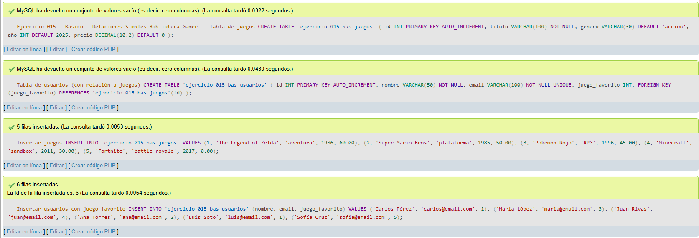
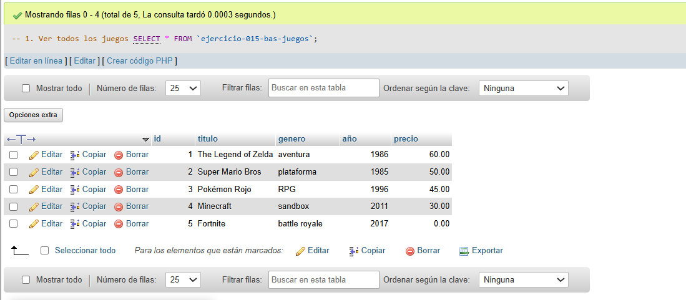
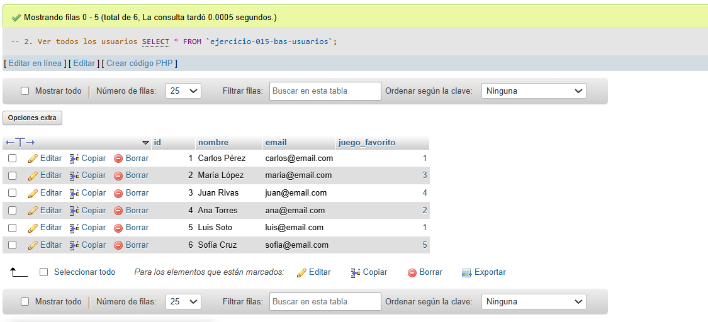
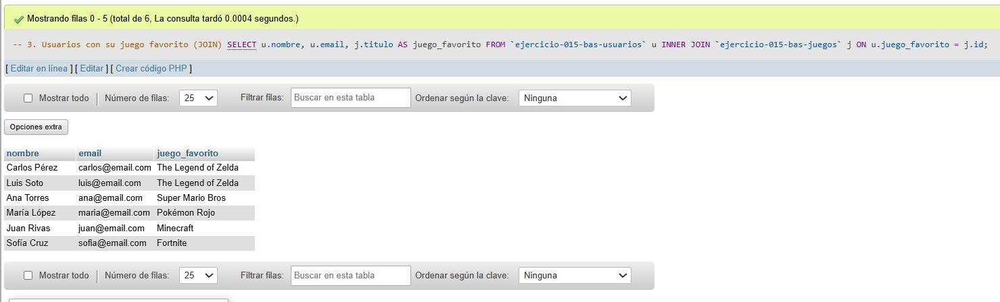
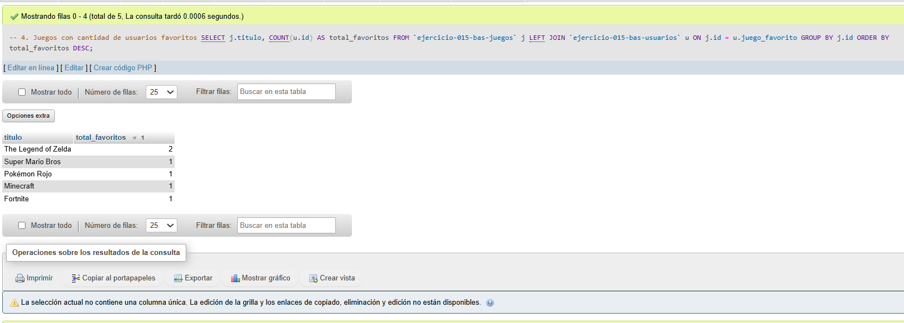
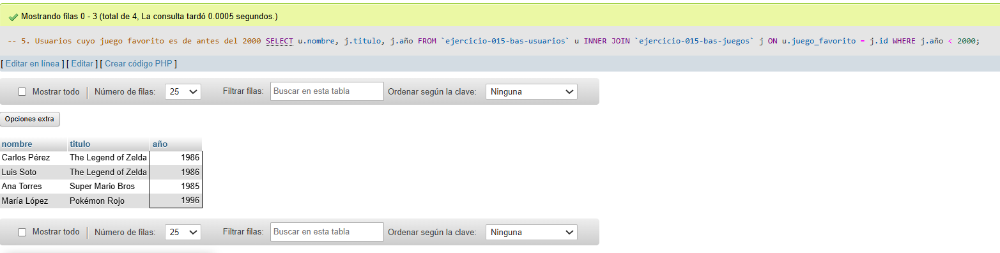

# Ejercicio 015 - Nivel Básico - Relaciones Simples Biblioteca Gamer

## 1. Temática

Biblioteca gamer con relaciones simples entre usuarios y juegos favoritos.

## 2. Decisiones Técnicas

- **Diseño de Tablas (DDL):**
  - Tabla de juegos: `ejercicio-015-bas-juegos`.
  - Tabla de usuarios: `ejercicio-015-bas-usuarios`.
  - FOREIGN KEY en `juego_favorito` → `ejercicio-015-bas-juegos(id)`.
  - UNIQUE en `email` para evitar duplicados.
  - Uso de comillas invertidas para nombres con guiones.

- **Relación:**
  - Un usuario tiene un juego favorito.
  - Un juego puede ser favorito de muchos usuarios.
  - Relación 1 a muchos (uno a muchos).

- **Inserción de Datos (DML):**
  - 5 juegos de diferentes géneros y épocas.
  - 6 usuarios con juegos favoritos.

- **Consultas (DQL):**
  - Ver todos los datos.
  - JOIN para mostrar usuarios con su juego favorito.
  - LEFT JOIN para contar favoritos por juego.
  - Filtros con WHERE y JOIN.

## 3. Evidencias

*A continuación, se adjuntan capturas de pantalla que demuestran la ejecución y los resultados de los scripts SQL en phpMyAdmin.*

Definición de tablas e inserción de datos

Consulta 1

Consulta 2

Consulta 3

Consulta 4

Consulta 5
