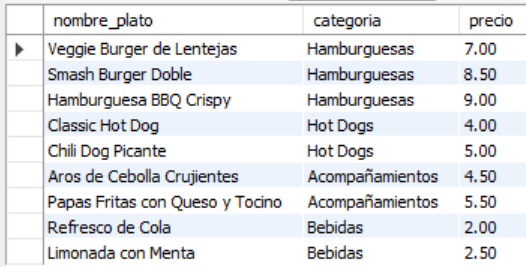
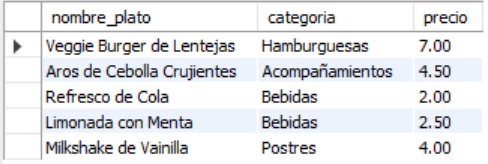
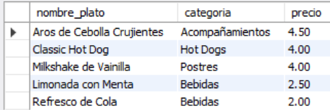
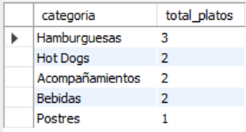
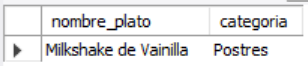

# Ejercicio Básico 016 - CREATE TABLE

**Camper:** Antonio Canux

## Descripción

Decimosexto ejercicio de nivel básico, enfocado en un módulo de datos de un restaurante de comida urbana. El objetivo principal de esta práctica es reforzar el dominio sobre la sentencia **`CREATE TABLE`** en MySQL, asegurando un diseño estructural robusto desde el primer momento. A nivel profesional, la creación de una tabla implica elegir cuidadosamente los tipos de datos: usamos `DECIMAL` en lugar de `FLOAT` para manejar dinero (precios) con precisión matemática, `ENUM` para restringir las categorías permitidas, y `BOOLEAN` (que MySQL interpreta como `TINYINT(1)`) para crear banderas de estado lógicas (`es_vegetariano`, `disponible`).

---

## Tabla utilizada

**basico_ejercicio_016_menu**
- id (PK)
- nombre_plato (VARCHAR, NOT NULL)
- categoria (ENUM, NOT NULL)
- precio (DECIMAL 6,2, NOT NULL)
- es_vegetariano (BOOLEAN, DEFAULT FALSE)
- disponible (BOOLEAN, DEFAULT TRUE)
- creado_en (DATETIME, DEFAULT CURRENT_TIMESTAMP)

---

## Consultas realizadas

### 1. ¿Cuál es el menú completo actualmente disponible ordenado por categorías?

```sql
SELECT nombre_plato, categoria, precio 
    FROM basico_ejercicio_016_menu 
    WHERE disponible = TRUE 
    ORDER BY categoria, precio ASC;
```

**Resultado**



---

### 2. ¿Cuáles son las opciones exclusivamente vegetarianas del menú?

```sql
SELECT nombre_plato, categoria, precio 
    FROM basico_ejercicio_016_menu 
    WHERE es_vegetariano = TRUE;
```

**Resultado**



---

### 3. ¿Qué platos se pueden adquirir por un costo menor a $5.00 (opciones económicas)?

```sql
SELECT nombre_plato, categoria, precio 
    FROM basico_ejercicio_016_menu 
    WHERE precio < 5.00 
    ORDER BY precio DESC;
```

**Resultado**



---

### 4. ¿Cuántos platos hay registrados en la base de datos por cada categoría del menú?

```sql
SELECT categoria, COUNT(id) AS total_platos 
    FROM basico_ejercicio_016_menu 
    GROUP BY categoria;
```

**Resultado**



---

### 5. ¿Qué productos se encuentran actualmente agotados o no disponibles?

```sql
SELECT nombre_plato, categoria 
    FROM basico_ejercicio_016_menu 
    WHERE disponible = FALSE;
```

**Resultado**



---

## Herramientas

- MySQL
- MySQL Workbench
- Git
- GitHub

---

**Campuslands · Skill SQL**