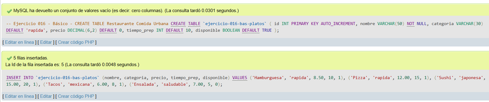
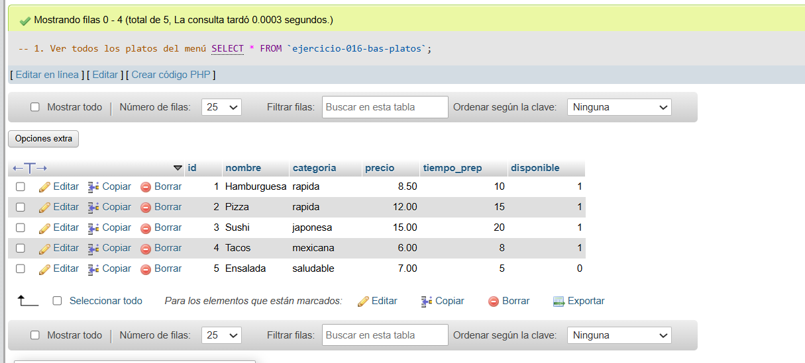
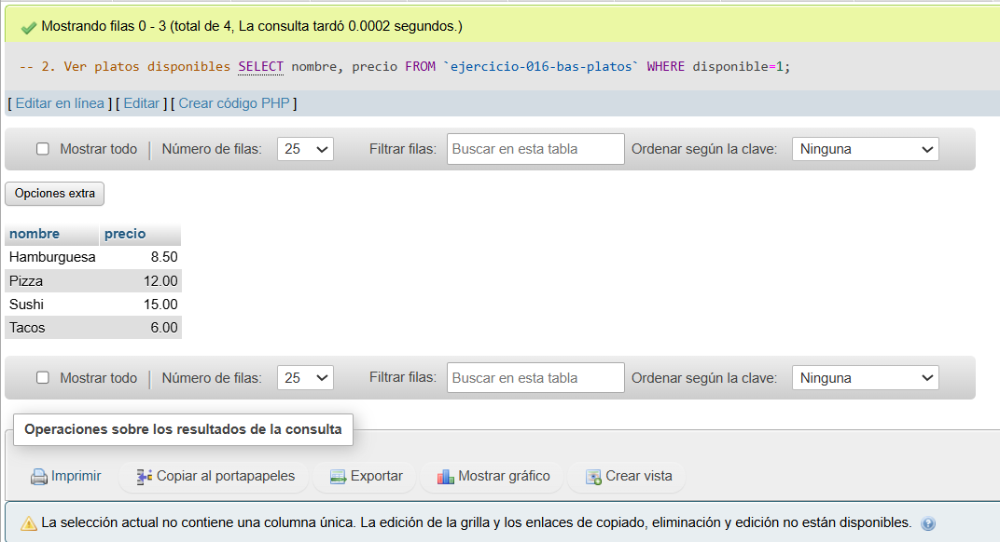
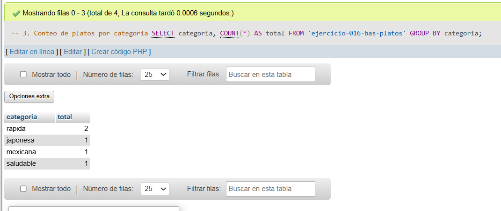

# Ejercicio 016 - Nivel Básico - Restaurante Comida Urbana

## 1. Temática

Restaurante de comida urbana con CREATE TABLE para gestionar platos del menú.

## 2. Decisiones Técnicas

- **Diseño de Tablas (DDL):**
  - Una tabla: `ejercicio-016-bas-platos`.
  - Columnas: `id`, `nombre`, `categoria`, `precio`, `tiempo_prep`, `disponible`.
  - PRIMARY KEY en `id` con AUTO_INCREMENT.
  - Uso de comillas invertidas para nombres con guiones.

- **Inserción de Datos (DML):**
  - 5 platos con diferentes categorías y precios.
  - 1 plato no disponible para pruebas.

- **Consultas (DQL):**
  - La consulta `1` muestra todos los platos del menú.
  - La consulta `2` filtra los platos disponibles.
  - La consulta `3` agrupa y cuenta por categoría.

## 3. Evidencias

<!-- Capturas aquí -->

*A continuación, se adjuntan capturas de pantalla que demuestran la ejecución y los resultados de los scripts SQL en phpMyAdmin.*

Definición de tablas e inserción de datos

Consulta 1

Consulta 2

Consulta 3

