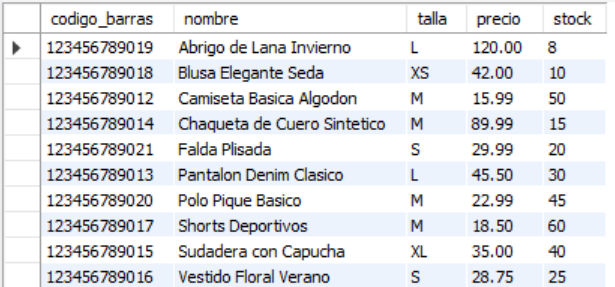
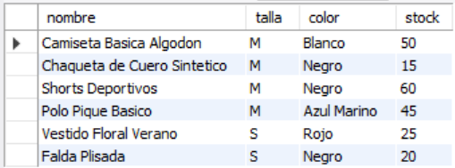
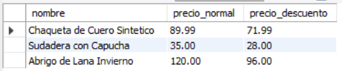
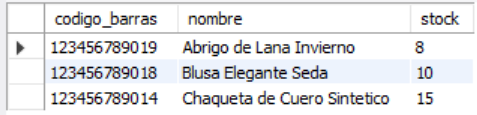
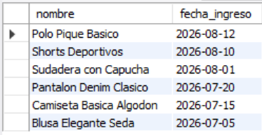

# Ejercicio Básico 017 - Tipos de Datos

**Camper:** Antonio Canux

## Descripción

Decimoséptimo ejercicio de nivel básico, enfocado en un módulo de datos para el inventario de una tienda de ropa. El objetivo principal de esta práctica es analizar y aplicar correctamente los **Tipos de Datos** en MySQL. A nivel profesional, la optimización comienza en el DDL: utilizamos `CHAR(12)` de longitud fija para códigos de barras universales en lugar de `VARCHAR`, aplicamos `SMALLINT` para un inventario de tienda que no excederá números gigantescos (ahorrando espacio respecto a un `INT` normal), restringimos las tallas usando `ENUM`, y mantenemos `DECIMAL` para cálculos financieros de los precios de las prendas.

---

## Tabla utilizada

**basico_ejercicio_017_prendas**
- id (INT, PK)
- codigo_barras (CHAR 12, UNIQUE)
- nombre (VARCHAR)
- talla (ENUM)
- color (VARCHAR)
- precio (DECIMAL 8,2)
- stock (SMALLINT)
- en_oferta (BOOLEAN)
- fecha_ingreso (DATE)

---

## Consultas realizadas

### 1. ¿Cuál es el listado general del inventario de prendas?

```sql
SELECT codigo_barras, nombre, talla, precio, stock 
    FROM basico_ejercicio_017_prendas 
    ORDER BY nombre ASC;
```

**Resultado**



---

### 2. ¿Cuáles son las prendas disponibles en tallas Small (S) y Medium (M)?

```sql
SELECT nombre, talla, color, stock 
    FROM basico_ejercicio_017_prendas 
    WHERE talla IN ('S', 'M') 
    ORDER BY talla DESC;
```

**Resultado**



---

### 3. ¿Cuál sería el precio con un 20% de descuento aplicado a las prendas que están en oferta?

```sql
SELECT nombre, precio AS precio_normal, ROUND(precio * 0.80, 2) AS precio_descuento 
    FROM basico_ejercicio_017_prendas 
    WHERE en_oferta = TRUE;
```

**Resultado**



---

### 4. ¿Cuáles son las prendas con bajo stock (menos de 20 unidades) que requieren reabastecimiento?

```sql
SELECT codigo_barras, nombre, stock 
    FROM basico_ejercicio_017_prendas 
    WHERE stock < 20 
    ORDER BY stock ASC;
```

**Resultado**



---

### 5. ¿Qué prendas ingresaron al inventario a partir del segundo semestre del año (Julio 2026)?

```sql
SELECT nombre, fecha_ingreso 
    FROM basico_ejercicio_017_prendas 
    WHERE fecha_ingreso >= '2026-07-01' 
    ORDER BY fecha_ingreso DESC;
```

**Resultado**



---

## Herramientas

- MySQL
- MySQL Workbench
- Git
- GitHub

---

**Campuslands · Skill SQL**