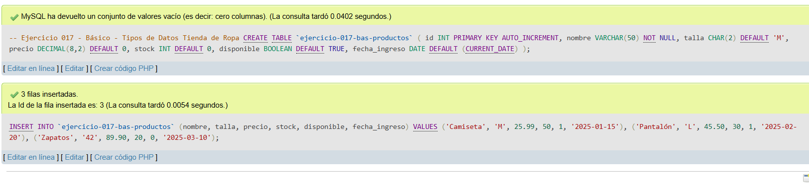
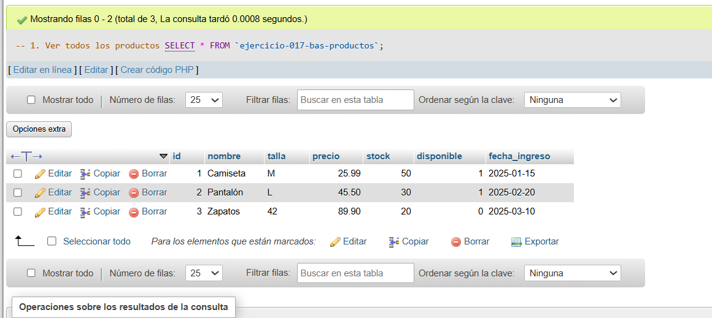
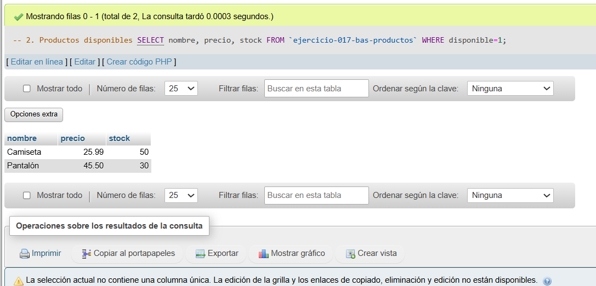
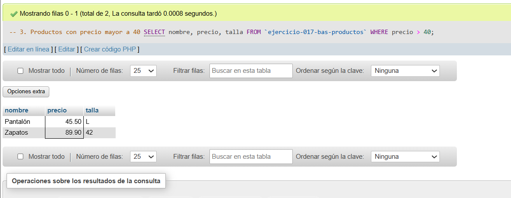

# Ejercicio 017 - Nivel Básico - Tipos de Datos Tienda de Ropa

## 1. Temática

Tienda de ropa con diferentes tipos de datos para gestionar productos.

## 2. Decisiones Técnicas

- **Diseño de Tablas (DDL):**
  - Una tabla: `ejercicio-017-bas-productos`.
  - Tipos usados: `VARCHAR`, `CHAR`, `DECIMAL`, `INT`, `BOOLEAN`, `DATE`.
  - PRIMARY KEY en `id` con AUTO_INCREMENT.
  - Uso de comillas invertidas para nombres con guiones.

- **Inserción de Datos (DML):**
  - 3 productos con diferentes tallas y precios.
  - 1 producto no disponible para pruebas.

- **Consultas (DQL):**
  - La consulta `1` muestra todos los productos.
  - La consulta `2` filtra productos disponibles.
  - La consulta `3` filtra por precio mayor a 40.

## 3. Evidencias

<!-- Capturas aquí -->

*A continuación, se adjuntan capturas de pantalla que demuestran la ejecución y los resultados de los scripts SQL en phpMyAdmin.*

Definición de tablas e inserción de datos

Consulta 1

Consulta 2

Consulta 3

